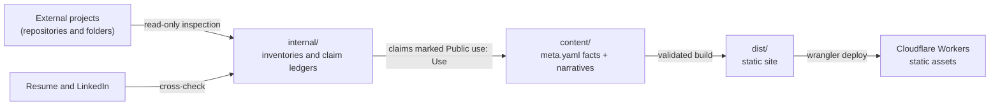
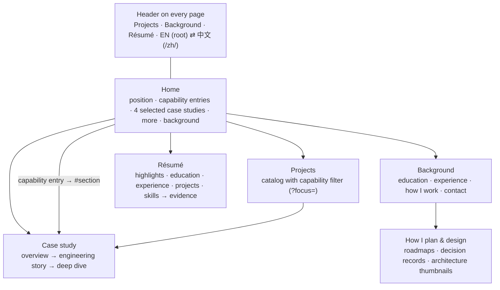

# Portfolio Architecture

**Last reviewed:** 2026-09-25 (redesign, ADR-016)

This document separates what exists (**CURRENT**) from what is planned (**PROPOSED**). Nothing marked PROPOSED
exists yet.

## CURRENT: repository layout

```text
personal_portfolio/
├── README.md, AGENTS.md, CLAUDE.md
├── PROJECT_CONTEXT.md, ARCHITECTURE.md, DECISIONS.md
├── docs/style/          BILINGUAL_STYLE.md, GLOSSARY.md
├── content/             track registry, résumé data, UI strings, page and project modules (see below)
├── src/                 Astro site: layouts, components, pages, content loader, styles
├── public/              _headers, _redirects, .assetsignore, js/site.js, favicon, self-hosted fonts
├── scripts/             render-diagrams.mjs, postbuild.mjs, check-dist.mjs
├── diagrams/            mermaid.config.json (the diagram theme)
├── astro.config.mjs, wrangler.jsonc, package.json, .node-version
├── .github/workflows/   ci.yml
└── internal/            git-ignored: source registry, inventories, ledgers, strategy, estimate, state
```

- External projects are evidence sources that live outside this repository.
- `internal/` refers to them by repository, commit SHA and path. They are never copied in (ADR-002).
- Reviewed assets taken from external projects (screenshots, plots) are listed with their provenance in each module's
  `ASSETS.md` (ADR-011).



## CURRENT: content model

Each project is a self-contained module. The catalog references projects by slug only.

```text
content/
├── catalog.yaml                capability filters, featured and "more" projects, catalog order, home capability
│                               entries (the only place ordering lives)
├── profile.yaml                résumé data: headline, education, experience, highlights, skills → evidence links
├── site/{en,zh}.yaml           UI strings per locale (identical key sets)
├── pages/<page>/               background, plan-and-design: en.md, zh.md, optional meta.yaml
└── projects/<slug>/
    ├── meta.yaml               language-neutral facts: capabilities (focus), status and status note, team, period,
    │                           stack, links, overview, card, facts, figures, roadmap, related, anchor aliases
    ├── en.md, zh.md            narratives: the same "## Title {#id}" sections; numbers only via {{fact:key}}
    ├── ASSETS.md               provenance and label of every staged asset
    └── assets/                 Mermaid sources and rendered SVGs, screenshots, plots
```

**Rules** (enforced by the content loader at build time)
- **Add a project:** create `content/projects/<slug>/` and add the slug to `order` in `catalog.yaml`.
- **Hide or remove:** delete the slug from `order`. The module can stay.
- **Re-rank or feature:** edit `order`, `featured` or `more` in `catalog.yaml`, and nothing else.
- **Capabilities:** a project declares one primary capability and any others in `meta.yaml` (`focus`). The catalog
  filter and the capability labels come from there.
- **Featured projects** must have an editor-written `card` (key question, one-line contribution, at most three
  technologies, the section the main link opens, and a figure or a short step list) and an `overview` (problem, my
  contribution, outcome and validation). Every `#anchor` a card or a home entry points to must exist.
- **Retired section ids** are listed in `anchor_aliases`, so old links keep landing on the replacing section.
- **Numbers live only in `meta.yaml`.** Narratives reference them as `{{fact:key}}` (pages: `{{fact:slug.key}}`), so
  English and Chinese can never disagree. A measurement written directly in a narrative fails the build.
- **Every fact cites an internal ledger claim ID.** The build never renders it, and the output scan fails if one
  appears.
- **Figures** are attached to sections in `meta.yaml`, each with a CURRENT / PROPOSED / HISTORICAL label and alt text
  and a caption in both languages.

## CURRENT: site map



**Case study layers**
1. **First screen (30 s):** capabilities, title, what it does, status and status note, role, team, period, context,
   Demo / Source links, and the overview: problem, my contribution, outcome and validation. Key facts follow.
2. **Engineering story (3 min):** the sections before the "Deep dive" marker — the situation, ownership, and two
   design questions with their trade-offs, then results and limits.
3. **Deep dive:** the sections from the marker on, the full stack, one related case study and the way back to the
   catalog. An "On this page" list sits beside the text on desktop and as a disclosure on narrow screens.

**Retired URLs** (ADR-016): `/about/` → `/background/`; `/tracks/sde/` → `/projects/`;
`/tracks/cloud-llm/` → `/projects/?focus=backend-cloud`; `/tracks/ds-finance/` → `/projects/?focus=ai-research`;
the same under `/zh/`. Project URLs did not change.

## CURRENT: build and hosting (ADR-014, ADR-015)

**Stack.** Astro 7, static output, no adapter. One first-party script (`public/js/site.js`, ADR-016) adds the mobile
menu, the catalog filter and a hash-preserving language switch; every page works without it. Own content loader (`src/lib/content/`):
YAML parsed with `yaml`, validated with Zod, Markdown rendered with `marked`. Images through `astro:assets` (sharp).

**Internationalization**
- English at the root, Chinese under `/zh/`. Each page type is one route file (`src/pages/[...locale]/…`) that renders
  both languages from the same data.
- `<html lang>` is `en` or `zh-CN`. With `SITE_URL` set, every page has a canonical URL and `hreflang` alternates
  (en, zh-CN, x-default); a sitemap is generated.
- The language switch links to the same page in the other language. No automatic redirect, no cookie.

**Privacy, security, reachability**
- No requests to third-party origins: fonts (Source Serif 4, OFL), images and styles are self-hosted.
- No analytics.
- CSP `default-src 'self'` without `'unsafe-inline'`, sent as a `<meta>` tag and as a header (`public/_headers`, which
  also sets `frame-ancestors`, `X-Frame-Options`, `X-Content-Type-Options`, `Referrer-Policy`, `Permissions-Policy`).
  SVG assets get their own policy so that diagram styles render.
- `noindex` unless `SITE_URL` and `SITE_INDEXING=true` are both set.

**Content safety**
- The build reads only `content/` and `src/`.
- `scripts/check-dist.mjs` fails the build on local paths, private IPs, account IDs, keys, email addresses, ledger
  claim IDs, `internal/` references, private working names, inline code, any script other than `/js/site.js`,
  third-party resources, broken internal links or anchors, redirects to missing pages or other redirects, a wrong
  `<html lang>` or a missing CSP.
- `public/.assetsignore` keeps build internals out of an upload even after a failed build.
- Links to external repositories follow the public-link gate (ADR-004).

**Hosting.** Cloudflare Workers static assets (`wrangler.jsonc`): `not_found_handling: "404-page"` serves the nearest
`404.html` (English at the root, Chinese under `/zh/`), `html_handling: "auto-trailing-slash"` normalizes URLs, and
`public/_redirects` holds the permanent redirects for retired pages.

**CI.** `.github/workflows/ci.yml` runs `npm ci` and `npm run build` on every push and pull request.

## PROPOSED

- **Résumé PDF download**, offered only after the PDF résumé matches the verified facts (the owner's pending resume
  decisions).
- **Code links** for Cloud-Native, Equipment & Assignment and Quant AI, after their repository cleanup (ADR-004).
- **Indexing**, after the owner reviews the Chinese copy and binds the custom domain.

**Precedent:** the owner's public KK Knock introduction page follows the same rules: no third-party origins, a
`default-src 'self'` CSP, and bilingual content.
