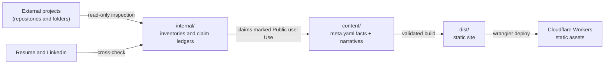
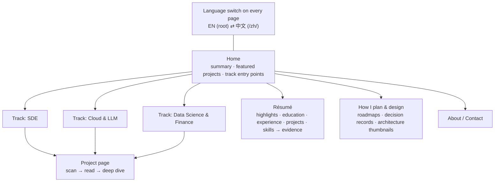

# Portfolio Architecture

**Last reviewed:** 2026-09-24

This document separates what exists (**CURRENT**) from what is planned (**PROPOSED**). Nothing marked PROPOSED
exists yet.

## CURRENT: repository layout

```text
personal_portfolio/
├── README.md, AGENTS.md, CLAUDE.md
├── PROJECT_CONTEXT.md, ARCHITECTURE.md, DECISIONS.md
├── docs/style/          BILINGUAL_STYLE.md, GLOSSARY.md
├── content/             track registry, résumé data, UI strings, page and project modules (see below)
├── src/                 Astro site: layouts, components, pages, content loader, styles
├── public/              _headers, .assetsignore, favicon, self-hosted fonts
├── scripts/             render-diagrams.mjs, postbuild.mjs, check-dist.mjs
├── diagrams/            mermaid.config.json (the diagram theme)
├── astro.config.mjs, wrangler.jsonc, package.json, .node-version
├── .github/workflows/   ci.yml
└── internal/            git-ignored: source registry, inventories, ledgers, strategy, estimate, state
```

- External projects are evidence sources that live outside this repository.
- `internal/` refers to them by repository, commit SHA and path. They are never copied in (ADR-002).
- Reviewed assets taken from external projects (screenshots, plots) are listed with their provenance in each module's
  `ASSETS.md` (ADR-011).



## CURRENT: content model

Each project is a self-contained module. Tracks reference projects by slug only.

```text
content/
├── tracks.yaml                 track order, cross-listing, featured projects (the only place ordering lives)
├── profile.yaml                résumé data: education, experience, highlights, skills → evidence links
├── site/{en,zh}.yaml           UI strings per locale (identical key sets)
├── pages/<page>/               about, plan-and-design: en.md, zh.md, optional meta.yaml
└── projects/<slug>/
    ├── meta.yaml               language-neutral facts: tracks, status, team, period, stack, links, facts, figures, roadmap
    ├── en.md, zh.md            narratives: the same "## Title {#id}" sections; numbers only via {{fact:key}}
    ├── ASSETS.md               provenance and label of every staged asset
    └── assets/                 Mermaid sources and rendered SVGs, screenshots, plots
```

**Rules** (enforced by the content loader at build time)
- **Add a project:** create `content/projects/<slug>/` and add the slug to the tracks its `meta.yaml` declares.
- **Hide or remove:** delete the slug from `tracks.yaml`. The module can stay.
- **Re-rank:** reorder slugs in `tracks.yaml`, and nothing else.
- **Cross-list:** declare the extra track in `meta.yaml` and list the slug under it. The project page is rendered once
  and has one canonical URL.
- **Numbers live only in `meta.yaml`.** Narratives reference them as `{{fact:key}}` (pages: `{{fact:slug.key}}`), so
  English and Chinese can never disagree. A measurement written directly in a narrative fails the build.
- **Every fact cites an internal ledger claim ID.** The build never renders it, and the output scan fails if one
  appears.
- **Figures** are attached to sections in `meta.yaml`, each with a CURRENT / PROPOSED / HISTORICAL label and alt text
  and a caption in both languages.

## CURRENT: site map



**Project page layers**
1. **Scan (30 s):** title and subtitle, status badge, tracks, role, team, period, context, stack chips, links, and an
   "at a glance" box with the one-line problem and two or three verified facts.
2. **Read (3 min):** the narrative sections before the "Deep dive" marker — typically the CURRENT architecture, how
   the work was planned (with a roadmap), key decisions with trade-offs, and what the owner owned.
3. **Deep dive:** the sections from the marker on — decision details, PROPOSED architecture, failure analysis,
   testing and operations, limits and next steps.

## CURRENT: build and hosting (ADR-014, ADR-015)

**Stack.** Astro 7, static output, no adapter, no client-side JavaScript. Own content loader (`src/lib/content/`):
YAML parsed with `yaml`, validated with Zod, Markdown rendered with `marked`. Images through `astro:assets` (sharp).

**Internationalization**
- English at the root, Chinese under `/zh/`. Each page type is one route file (`src/pages/[...locale]/…`) that renders
  both languages from the same data.
- `<html lang>` is `en` or `zh-CN`. With `SITE_URL` set, every page has a canonical URL and `hreflang` alternates
  (en, zh-CN, x-default); a sitemap is generated.
- The language switch links to the same page in the other language. No automatic redirect, no cookie.

**Privacy, security, reachability**
- No requests to third-party origins: fonts (Source Serif 4, OFL), images and styles are self-hosted.
- No analytics.
- CSP `default-src 'self'` without `'unsafe-inline'`, sent as a `<meta>` tag and as a header (`public/_headers`, which
  also sets `frame-ancestors`, `X-Frame-Options`, `X-Content-Type-Options`, `Referrer-Policy`, `Permissions-Policy`).
  SVG assets get their own policy so that diagram styles render.
- `noindex` unless `SITE_URL` and `SITE_INDEXING=true` are both set.

**Content safety**
- The build reads only `content/` and `src/`.
- `scripts/check-dist.mjs` fails the build on local paths, private IPs, account IDs, keys, email addresses, ledger
  claim IDs, `internal/` references, private working names, inline code, third-party resources, broken internal links
  or anchors, a wrong `<html lang>` or a missing CSP.
- `public/.assetsignore` keeps build internals out of an upload even after a failed build.
- Links to external repositories follow the public-link gate (ADR-004).

**Hosting.** Cloudflare Workers static assets (`wrangler.jsonc`): `not_found_handling: "404-page"` serves the nearest
`404.html` (English at the root, Chinese under `/zh/`), and `html_handling: "auto-trailing-slash"` normalizes URLs.

**CI.** `.github/workflows/ci.yml` runs `npm ci` and `npm run build` on every push and pull request.

## PROPOSED

- **Résumé PDF download**, offered only after the PDF résumé matches the verified facts (the owner's pending resume
  decisions).
- **Code links** for Cloud-Native, Equipment & Assignment and Quant AI, after their repository cleanup (ADR-004).
- **Indexing**, after the owner reviews the Chinese copy and binds the custom domain.

**Precedent:** the owner's public KK Knock introduction page follows the same rules: no third-party origins, a
`default-src 'self'` CSP, and bilingual content.
