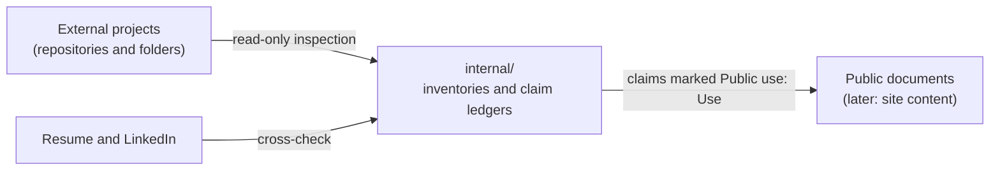
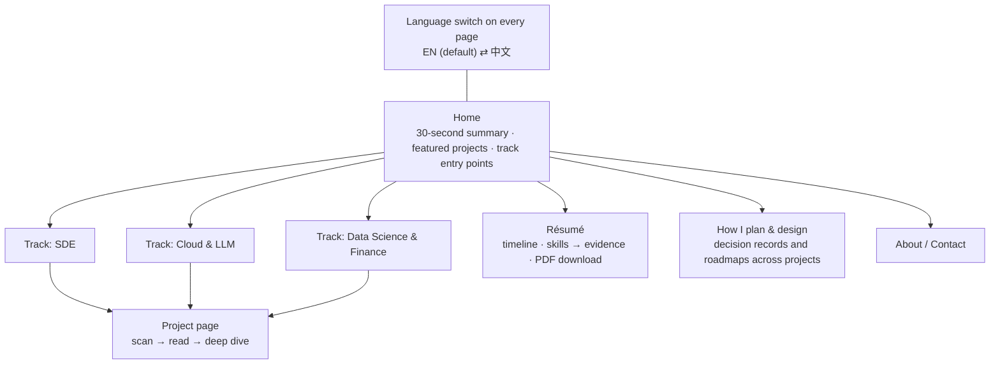

# Portfolio Architecture

**Last reviewed:** 2026-09-24

This document separates what exists (**CURRENT**) from what is planned (**PROPOSED**). Nothing marked PROPOSED
exists yet.

## CURRENT: documentation repository with a content skeleton

```text
personal_portfolio/
├── README.md, AGENTS.md, CLAUDE.md
├── PROJECT_CONTEXT.md, ARCHITECTURE.md, DECISIONS.md
├── docs/style/          BILINGUAL_STYLE.md, GLOSSARY.md
├── content/             skeleton only (ADR-011): README.md + projects/<slug>/{ASSETS.md, assets/}
└── internal/            git-ignored: source registry, inventories, ledgers, strategy, estimate, state
```

Staged assets are labeled `CURRENT`, `PROPOSED` or `HISTORICAL` (ADR-011). `HISTORICAL` assets, such as early
wireframes, appear only in the "How it was planned" sections.

- External projects are evidence sources that live outside this repository.
- `internal/` refers to them by repository, commit SHA and path. They are never copied in (ADR-002).



## PROPOSED: content model

- Each project is a self-contained module.
- Tracks reference projects by slug only.
- The layout follows the tree below.

```text
content/
├── tracks.yaml                 track order, cross-listing, featured flags (the only place ordering lives)
├── profile.yaml                language-neutral résumé data: education, experience, skills → evidence links
├── site/{en,zh}.yaml           UI strings per locale
└── projects/<slug>/
    ├── meta.yaml               language-neutral facts: tracks, status label, stack, dates, links, numbers
    ├── en.md                   English narrative; references facts by key
    ├── zh.md                   Chinese narrative; same sections and anchors as en.md
    └── assets/                 Mermaid sources, diagrams, screenshots
```

Illustrative shapes (placeholder values):

```yaml
# content/tracks.yaml
tracks:
  - id: sde
    title: { en: "SDE", zh: "软件开发" }
    projects: [project-a, project-b]      # order = display order
  - id: cloud-llm
    title: { en: "Cloud & LLM", zh: "云计算与大模型" }
    projects: [project-c, project-a]      # project-a is cross-listed
```

```yaml
# content/projects/project-a/meta.yaml
slug: project-a
tracks: { primary: sde, also: [cloud-llm] }
status: implemented-not-deployed          # rendered via the glossary label in each language
facts:
  example_latency_ms: { value: 120, condition: { en: "single load test", zh: "单次压测" }, claim: "<ledger id>" }
```

**Rules**
- **Add a project:** create `content/projects/<slug>/` and add the slug to one or more tracks in `tracks.yaml`.
- **Hide or remove:** delete the slug from `tracks.yaml`. The module can stay.
- **Re-rank:** reorder slugs in `tracks.yaml`, and nothing else.
- **Cross-list:** list the slug under several tracks. The project page is rendered once and has one canonical URL.
- **Numbers live only in `meta.yaml`.** Both languages render them from there, so English and Chinese can never
  disagree.
- **Every fact cites an internal ledger claim ID.** The build strips the ID from its output.

## PROPOSED: site map



**Project page layers**
1. **Scan (30 s):**
   - title and one-line problem;
   - role and status label;
   - stack chips;
   - two or three verified outcomes.
2. **Read (3 min):**
   - the CURRENT architecture diagram;
   - how the work was planned (phases or milestones);
   - three to five key decisions with their trade-offs;
   - what the owner personally owned.
3. **Deep dive:**
   - decision records (context → options → decision → consequences);
   - PROPOSED architecture and roadmap;
   - failure analysis;
   - testing and operations;
   - what I would do next;
   - links to public code.

**Résumé page** — a visual, bilingual résumé that stands out while staying consistent with the PDF résumé:
- **Header:** name, target roles, and a short positioning statement per track.
- **Timeline:** education, internships and projects in one timeline.
- **Skills matrix:** grouped by track. Every skill links to the project pages that prove it; skills with no evidence
  are not shown.
- **PDF download:** offered only after the résumé matches the verified facts.

**"How I plan & design" page** — shows planning and architecture ability directly:
- a gallery of decision records and roadmaps drawn from the projects;
- each item links back to its project.

## PROPOSED: build-phase requirements

These apply once the discovery gate is cleared (ADR-009).

**Technology route (ADR-014):** Astro, hosted on Cloudflare Pages. Implementation choices are made in the build phase
and must meet the requirements below.

**Internationalization**
- English is the default language at the site root, and Chinese is reached through the language switch. Each
  language has its own linkable, indexable URLs.
- Every page has `hreflang` alternates and `<html lang>` set per locale (`en`, `zh-CN`).
- The language switch on every page keeps the reader on the same page in the other language.
- There is no automatic redirect and no cookie.
- The build fails if a page, string or fact exists in one language but not the other.

**Privacy, security, reachability**
- No requests to third-party origins. Fonts, images and scripts are self-hosted. This also keeps the site usable
  from mainland China.
- No analytics by default.
- A strict Content-Security-Policy (`default-src 'self'`) and no inline scripts.

**Content safety**
- The build reads only `content/`.
- It fails if the output contains any of: text from `internal/`, local paths, private IPs, account IDs, tokens, or
  email addresses other than the published contact.
- Links to external repositories must pass the public-link gate (ADR-004).

**Quality and presentation**
- Static output and a fast first load; images are sized and lazy-loaded.
- A consistent visual system for diagrams, status labels and stack chips, so architecture and planning content
  reads as a set.
- Accessibility: semantic headings, alt text in both languages, keyboard navigation, sufficient contrast.
- CI runs a link check and a zh/en parity check.

**Precedent:** the owner's public KK Knock introduction page already follows the same rules:
- English and Chinese content as sibling elements;
- no third-party origins;
- `localStorage` limited to the language choice;
- a `default-src 'self'` CSP.
