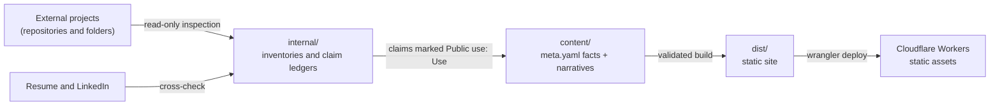
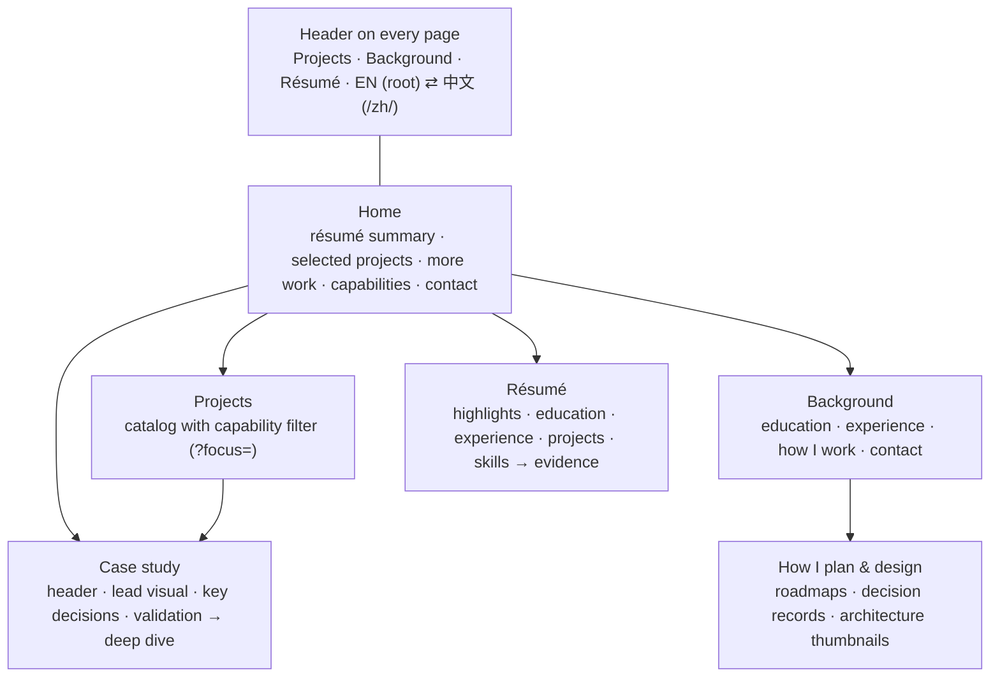
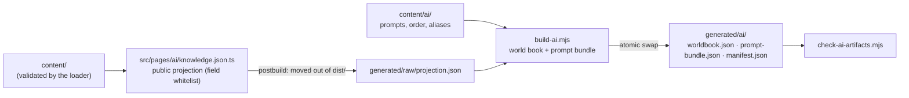
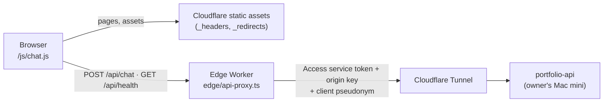

# Portfolio Architecture

**Last reviewed:** 2026-10-08 (AI assistant: knowledge build, backend, chat window and Edge Worker, ADR-022)

This document separates what exists (**CURRENT**) from what is planned (**PROPOSED**). Nothing marked PROPOSED
exists yet.

## CURRENT: repository layout

```text
personal_portfolio/
├── README.md, AGENTS.md, CLAUDE.md
├── PROJECT_CONTEXT.md, ARCHITECTURE.md, DECISIONS.md
├── docs/style/          BILINGUAL_STYLE.md, GLOSSARY.md
├── docs/AI_Chat/        AI assistant: design (SDD), deployment contract, implementation log (ADR-022)
├── content/             track registry, résumé data, UI strings, page and project modules, ai/ prompts (see below)
├── src/                 Astro site: layouts, components, pages, content loader, AI projection, styles;
│                        src/client/: the AI assistant's chat.js and chat.css (copied to dist/ only when enabled)
├── edge/                api-proxy.ts: the Worker script for /api and /api/* (ADR-022)
├── public/              _headers, _redirects, .assetsignore, js/site.js, favicon, self-hosted fonts
├── scripts/             render-diagrams.mjs, postbuild.mjs, check-dist.mjs, AI knowledge build and checks
├── shared/ai/           tokenizer, retrieval and prompt assembly shared by the build and the AI backend
├── tests/ai/, tests/edge/  node --test suites: AI knowledge and prompt build, chat client helpers, Edge Worker
├── backend/             portfolio-api: the AI assistant's backend (Node built-ins only), Dockerfile, tests
├── deploy/              compose.portfolio.yaml: deployment template for the backend (placeholders only)
├── generated/           git-ignored build output for the AI assistant (never part of dist/)
├── diagrams/            mermaid.config.json (the diagram theme)
├── astro.config.mjs, wrangler.jsonc, package.json, .node-version
├── .github/workflows/   ci.yml
└── internal/            git-ignored: source registry, inventories, ledgers, strategy, estimate, state
```

- External projects are evidence sources that live outside this repository.
- `internal/` refers to them by repository, commit SHA and path. They are never copied in (ADR-002).
- Reviewed assets taken from external projects (screenshots, plots) are listed with their provenance in each module's
  `ASSETS.md` (ADR-011).


```mermaid
%% CURRENT
flowchart LR
  EP["External projects<br/>(repositories and folders)"] -- read-only inspection --> INV["internal/<br/>inventories and claim ledgers"]
  RES["Resume and LinkedIn"] -- cross-check --> INV
  INV -- "claims marked Public use: Use" --> CON["content/<br/>meta.yaml facts + narratives"]
  CON -- "validated build" --> SITE["dist/<br/>static site"]
  SITE -- "wrangler deploy" --> CF["Cloudflare Workers<br/>static assets"]
```

## CURRENT: content model

Each project is a self-contained module. The catalog references projects by slug only.

```text
content/
├── catalog.yaml                capability filters, the home page's project slots (flagship, cases, exploring,
│                               more) and the catalog order (the only place ordering lives)
├── profile.yaml                résumé data: headline, education, experience, highlights, skills → evidence links
├── site/{en,zh}.yaml           UI strings per locale (identical key sets)
├── ai/                         AI assistant prompt layers, assembly order, retrieval aliases (ADR-022)
├── pages/<page>/               background, plan-and-design: en.md, zh.md, optional meta.yaml
└── projects/<slug>/
    ├── meta.yaml               language-neutral facts: capabilities (focus), status and status note, team, period,
    │                           role, stack, links, lead figure, card, facts, figures, roadmap, related, anchor aliases
    ├── en.md, zh.md            narratives: the same "## Title {#id}" sections; numbers only via {{fact:key}}
    ├── ASSETS.md               provenance and label of every staged asset
    └── assets/                 Mermaid sources and rendered SVGs, screenshots, plots
```

**Rules** (enforced by the content loader at build time)
- **Add a project:** create `content/projects/<slug>/` and add the slug to `order` in `catalog.yaml`.
- **Hide or remove:** delete the slug from `order`. The module can stay.
- **Re-rank or feature:** edit `order` or the `home` slots in `catalog.yaml`, and nothing else.
- **Capabilities:** a project declares one primary capability and any others in `meta.yaml` (`focus`). The catalog
  filter and the capability labels come from there.
- **Home-page projects** must have an editor-written `card` (a short introduction with my part, one engineering
  highlight, an optional short status, at most three technologies, the section the main link opens). The flagship and
  the cases also need a visual: a page figure or a short flow list. Card text may not contain bare measurements.
  Every `#anchor` a card points to must exist.
- **One role statement per project** (`role`): what I owned, what was shared, how AI assistants were used. The page
  header shows it once; narratives do not repeat it.
- **Charts** (`kind: chart`) are drawn as inline SVG from values in `meta.yaml`. Each panel cites its ledger claim,
  and every printed value is a project fact or a baseline text.
- **Retired section ids** are listed in `anchor_aliases`, so old links keep landing on the replacing section.
- **Numbers live only in `meta.yaml`.** Narratives reference them as `{{fact:key}}` (pages: `{{fact:slug.key}}`), so
  English and Chinese can never disagree. A measurement written directly in a narrative fails the build.
- **Every fact cites an internal ledger claim ID.** The build never renders it, and the output scan fails if one
  appears.
- **Figures** are attached to sections in `meta.yaml`, each with a CURRENT / PROPOSED / HISTORICAL label and alt text
  and a caption in both languages.

## CURRENT: site map


```mermaid
%% CURRENT
flowchart TD
  LS["Header on every page<br/>Projects · Background · Résumé · EN (root) ⇄ 中文 (/zh/)"] --- H
  H["Home<br/>résumé summary · selected projects · more work · capabilities · contact"] --> P["Case study<br/>header · lead visual · key decisions · validation → deep dive"]
  H --> C["Projects<br/>catalog with capability filter (?focus=)"]
  C --> P
  H --> B["Background<br/>education · experience · how I work · contact"]
  H --> R["Résumé<br/>highlights · education · experience · projects · skills → evidence"]
  B --> D["How I plan & design<br/>roadmaps · decision records · architecture thumbnails"]
```

**Case study layers**
1. **First screen (30 s):** title, what it does, one status line, one role statement, period and context, outside
   links (product page, demo, video, grouped source repositories), then the lead visual — product screens, a key
   chart or an architecture preview — and the few facts worth remembering, each with its conditions.
2. **Engineering story (3 min):** the sections before the "Deep dive" marker — the situation, two or three key
   decisions told as problem → options → choice → cost → validation, and one section on what has been verified.
   Conditions that change a result stay next to that result.
3. **Deep dive:** the sections from the marker on, the full stack, one related case study and the way back to the
   catalog. An "On this page" list sits beside the text on desktop and as a disclosure on narrow screens.

**Retired URLs** (ADR-016): `/about/` → `/background/`; `/tracks/sde/` → `/projects/`;
`/tracks/cloud-llm/` → `/projects/?focus=backend-cloud`; `/tracks/ds-finance/` → `/projects/?focus=ai-research`;
the same under `/zh/`. ADR-017: `/projects/info6105-methods/` → `/projects/f1-bayesian/#foundations`. Other project
URLs did not change.

## CURRENT: build and hosting (ADR-014, ADR-015)

**Build chain** (`npm run build`): `astro build` → `postbuild.mjs` → `build-ai.mjs` → `check-dist.mjs` →
`check-ai-artifacts.mjs`. Any failing step fails the build. `npm test` runs the `node --test` suites, and CI runs both.

**Stack.** Astro 7, static output, no adapter. One first-party script (`public/js/site.js`, ADR-016) adds the mobile
menu, the catalog filter and a hash-preserving language switch; every page works without it.
- When the site is built with `PUBLIC_CHAT_ENABLED=true`, the AI assistant adds a second first-party script and a
  stylesheet, `/js/chat.js` and `/css/chat.css` (ADR-022). Without the flag, the output is byte-identical to a build
  without the assistant. Own content loader (`src/lib/content/`):
YAML parsed with `yaml`, validated with Zod, Markdown rendered with `marked`. Images through `astro:assets` (sharp).

**Internationalization**
- English at the root, Chinese under `/zh/`. Each page type is one route file (`src/pages/[...locale]/…`) that renders
  both languages from the same data.
- `<html lang>` is `en` or `zh-CN`. With `SITE_URL` set, every page has a canonical URL and `hreflang` alternates
  (en, zh-CN, x-default); a sitemap is generated.
- The language switch links to the same page in the other language. No automatic redirect, no cookie.

**Privacy, security, reachability**
- No requests to third-party origins: fonts (Source Serif 4, OFL), images and styles are self-hosted.
- No analytics.
- CSP `default-src 'self'` without `'unsafe-inline'`, sent as a `<meta>` tag and as a header (`public/_headers`, which
  also sets `frame-ancestors`, `X-Frame-Options`, `X-Content-Type-Options`, `Referrer-Policy`, `Permissions-Policy`).
  SVG assets get their own policy so that diagram styles render.
- `noindex` unless `SITE_URL` and `SITE_INDEXING=true` are both set.

**Content safety**
- The build reads only `content/` and `src/`.
- `scripts/check-dist.mjs` fails the build on local paths, private IPs, account IDs, keys, unapproved email addresses, ledger
  claim IDs, `internal/` references, private working names, inline code, any script other than `/js/site.js` (and
  `/js/chat.js` when the assistant is enabled; without the flag, any assistant file or widget fails the build),
  third-party resources, broken internal links or anchors, redirects to missing pages or other redirects, a wrong
  `<html lang>` or a missing CSP.
- `public/.assetsignore` keeps build internals out of an upload even after a failed build.
- Links to external repositories follow the public-link gate (ADR-004).

**Hosting.** Cloudflare Workers static assets (`wrangler.jsonc`): `not_found_handling: "404-page"` serves the nearest
`404.html` (English at the root, Chinese under `/zh/`), `html_handling: "auto-trailing-slash"` normalizes URLs, and
`public/_redirects` holds the permanent redirects for retired pages.
- Since ADR-022, the Worker also has a script, `edge/api-proxy.ts`. `run_worker_first: ["/api", "/api/*"]` sends only
  those paths to it; every other request goes straight to the assets, and `_headers` still applies to them (checked
  with `wrangler dev`).
- Until the Worker secrets are set, `/api/*` answers JSON 503 and the site is unaffected.

**CI.** `.github/workflows/ci.yml` runs `npm ci`, `npm run build` and `npm test` on every push and pull request.

## CURRENT: AI assistant knowledge build (ADR-022)

The assistant's knowledge is built with the site and from the same validated content. The chat window, Worker and
backend are implemented but not deployed (sections below). Design:
`docs/AI_Chat/AI_CHAT_DESIGN.md`; checks and runtime contract: `docs/AI_Chat/deployment-contract.md`.


```mermaid
%% CURRENT
flowchart LR
  C["content/<br/>(validated by the loader)"] --> P["src/pages/ai/knowledge.json.ts<br/>public projection (field whitelist)"]
  P -- "postbuild: moved out of dist/" --> R["generated/raw/projection.json"]
  A["content/ai/<br/>prompts, order, aliases"] --> B
  R --> B["build-ai.mjs<br/>world book + prompt bundle"]
  B -- "atomic swap" --> G["generated/ai/<br/>worldbook.json · prompt-bundle.json · manifest.json"]
  G --> K["check-ai-artifacts.mjs"]
```

- **Projection** (`src/lib/ai/public-projection.ts`): fields are picked one by one from the schema.
  - Never included: `fact.claim`, chart `panels[].claim`, `track`, figures, roadmaps and anchor aliases.
  - Narratives come from the loader's rendered sections, so facts are already substituted, then converted to plain
    text.
- **World book** (`scripts/build-worldbook.mjs`):
  - One entry per section and language, split at paragraph breaks above about 600 tokens.
  - Also one overview entry per project, five profile entries (from the résumé data) and one catalog entry.
  - Each entry carries a source link (page and `#anchor`). Any chunk that shows a fact value also lists that fact with
    its condition.
- **Prompt bundle** (`scripts/build-prompts.mjs`): compiles `content/ai/prompts/` in the order of
  `prompt-order.yaml` and fills in the build-time variables. It fails with file and line on unknown variables, budget
  overruns, a missing language, fact values or claim-like IDs.
- **Snapshot:** every build writes a complete new snapshot to a temporary folder and swaps it in, so removed content
  cannot survive. `knowledgeVersion` is a hash of the world book: the same content always gives the same version.
- **Gate** (`scripts/check-ai-artifacts.mjs`): fails on claim-like IDs, unrendered facts, internal references, local
  paths, key-like strings, unapproved emails, source links to missing pages or anchors, hidden projects, unequal
  English/Chinese section sets, a size over 2 MiB or a hash mismatch with the manifest. `check-dist.mjs` also scans
  `.json` output for claim IDs and internal references.
- **Shared runtime code** (`shared/ai/`): the tokenizer (English stems, Chinese bigrams, aliases), BM25 retrieval and
  prompt assembly. The backend uses the same files, and `npm run chat:preview` prints exactly what a model would
  receive.

## CURRENT (live since 2026-10-08): AI assistant backend (ADR-022)

`backend/` holds `portfolio-api`: Node 22 with `node:http`, no runtime dependencies, run with mock providers in
tests and locally (`npm run api:dev`). It runs on the owner's Mac mini as `st-portfolio-api` in the `ai_web` compose project (since 2026-10-08). Contract: `docs/AI_Chat/deployment-contract.md`
§4.

- **Routes.**
  - `GET /api/health` returns available / degraded / unavailable, and never calls a provider.
  - `POST /api/chat` returns `text/event-stream` with events `meta`, `status`, `delta`, `sources`, `done` and
    `error`. Every stream ends with exactly one `done` or `error`.
  - Every request needs `X-Origin-Key`, compared in constant time.
- **Request.** The JSON schema is strict: unknown fields, other roles and oversized text are rejected. A stale
  `knowledgeVersion` returns 409. The server keeps no conversation: the client sends its completed turns.
- **Retrieval and prompt.** Uses the shared code in `shared/ai/`.
  - Confidence requires both coverage of the question's words and portfolio vocabulary (a project name or a reviewed
    alias).
  - Below the threshold, the prompt gets the profile overview plus the two best hits, and a note saying the material
    may not answer the question.
- **Request guard** (`shared/ai/guard.mjs`, rules in `content/ai/guard.yaml`). The assistant answers only about the
  résumé and portfolio. Before any model is called, it refuses with a fixed reply:
  - greetings and thanks (a friendly pointer);
  - prompt injection, and using the window as a tool (code, writing, translation);
  - personal and private matters;
  - questions with no link to the portfolio (no project, no reviewed term, no mention of me, no confident match,
    and not a follow-up of an in-scope question).

  Refusals cost no model call and no daily quota. Injection, tool use and unrelated questions count as misuse:
  three within ten minutes block that visitor for ten minutes. An answer that starts writing code or repeating its
  instructions is replaced by the off-topic reply.
- **Model plans A → B → C.** The owner chooses every model: each plan is `API_URL_PLAN_x`, `MODEL_PLAN_x` and
  `KEY_PLAN_x`, and the code has no defaults. The protocol follows the URL (Gemini API address → Gemini, anything
  else → OpenAI-compatible). Each plan is tried once, and the request switches only before the first visible
  text.
  - 429 starts a cool-down; 401, 402, 403 and 404 disable the provider until restart; 400 and 422 stop the request.
  - A blocked request gets the fixed refusal.
  - Time budget: 10 s to the first text, 15 s between texts, 60 s in total. Heartbeats do not extend it.
- **Limits.** 6 requests per minute and 30 per hour per client pseudonym, 3 concurrent generations without
  queueing, and a daily cap.
  - The daily count is kept in a JSON file and survives restarts; if the file cannot be read or written, generation
    is refused.
  - The spending limits in the providers' consoles are the real ceiling.
- **Logs** are whitelisted fields only: never questions, answers, headers or keys.
- **Settings** are in the git-ignored `backend/.env` (template `backend/.env.example`): the origin key, the three
  model plans and the limits. The stack loads that file with `env_file`, so none of the stack's own secrets reach
  the container. `check-dist` and `check-ai-artifacts` fail if any of its values appears in the output.
- **Image** (`backend/Dockerfile`, built from the repository root after `npm run build`): `node:22-alpine` pinned by
  digest, uid 10001, read-only root filesystem, knowledge snapshot baked in, state on a volume.
  `deploy/compose.portfolio.yaml` is the stack template.

## CURRENT (live since 2026-10-08): AI assistant chat window and Edge Worker (ADR-022)


```mermaid
%% CURRENT
flowchart LR
  B["Browser<br/>/js/chat.js"] -- "pages, assets" --> S["Cloudflare static assets<br/>(_headers, _redirects)"]
  B -- "POST /api/chat · GET /api/health" --> W["Edge Worker<br/>edge/api-proxy.ts"]
  W -- "Access service token + origin key<br/>+ client pseudonym" --> T["Cloudflare Tunnel"]
  T --> A["portfolio-api<br/>(owner's Mac mini)"]
```

- **Chat window** (`src/components/ChatWidget.astro`, `src/client/chat.js`, `src/client/chat.css`): a launcher at the
  bottom right of every page, including the 404 pages.
  - The panel is 380 × 560 px; at 480 px wide or less it becomes a bottom drawer.
  - Every element ships hidden; the script reveals them, so without JavaScript the page is unchanged.
  - Strings live under `chat:` in `content/site/{en,zh}.yaml`. The suggested questions come from
    `content/ai/prompts/70-starters.yaml`.
- **Client behaviour.** Completed turns live in `sessionStorage` (`pfchat:v1`): at most eight rounds and 64 KB,
  sanitized on load, and gone when the tab closes.
  - Answers stream in. A visitor can stop an answer; a stopped or interrupted answer is shown as incomplete with a
    Regenerate button and is never stored.
  - A stale knowledge version (409) resets the conversation and asks again once. If the backend is unavailable, the
    question goes back into the input.
  - Answers render with `textContent` only, and `[Sn]` becomes a link to a site-internal page.
  - It avoids `#` links and `pushState`, so it does not interfere with `site.js`.
- **Edge Worker** (`edge/api-proxy.ts`): handles only `POST /api/chat` and `GET /api/health`. Other `/api` paths get
  404 and other methods 405.
  - A POST needs a same-site (or listed) `Origin`, JSON and at most 32 KiB.
  - The origin request is built from scratch: no client cookies or credentials. It adds the Access service token,
    the origin key and an HMAC pseudonym of the client IP. Streams pass through unbuffered and with `no-store`, and
    the visitor's abort signal is forwarded.
  - A non-JSON or non-stream answer from the origin (such as an Access login page or a redirect) becomes a JSON 503.

## PROPOSED

- **Résumé PDF download**, offered only after the PDF résumé matches the verified facts (the owner's pending resume
  decisions).
- **Code links** for Cloud-Native, Equipment & Assignment and Quant AI, after their repository cleanup (ADR-004).
- **Indexing**, after the owner reviews the Chinese copy and binds the custom domain.
- **AI assistant deployment** (ADR-022, SDD-AICHAT-001 §5.7, §10, §11 P4–P5):
  - the backend joins the owner's Mac mini compose project (renamed to `ai_web` on 2026-10-08);
  - a Tunnel hostname for the backend (Cloudflare Access optional; the origin key is required);
  - Worker secrets;
  - then a release with the flag off, followed by one with it on.
  - The static site keeps working when any part of the assistant is down.

**Precedent:** the owner's public KK Knock introduction page follows the same rules: no third-party origins, a
`default-src 'self'` CSP, and bilingual content.

Public job contact data is defined in `content/profile.yaml` and rendered by `ContactEmail.astro` on Home, Background and Résumé. Only the owner-confirmed address is allowlisted by the output safety scan (ADR-019). The attachment limit is a sender instruction, not an upload feature.
