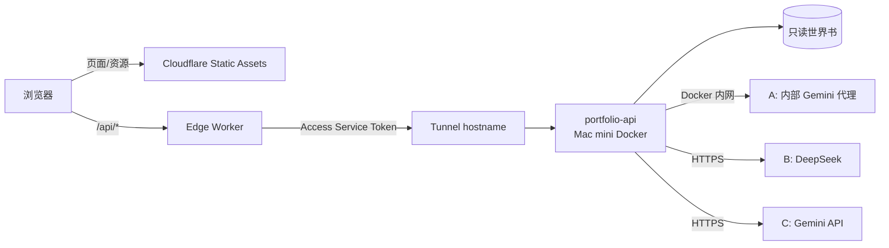

# Portfolio AI 助手（浮动客服窗）软件设计说明书

| 项 | 内容 |
|---|---|
| 文档编号 | SDD-AICHAT-001 |
| 版本 | 2.1（P0 查证后修订，取代 2.0；变更见附录 C） |
| 日期 | 2026-10-08 |
| 状态 | **已上线（2026-10-08）**：ADR-022 已由所有者确认为 Accepted。P0 结论见 `docs/AI_Chat/deployment-contract.md`，实施与部署记录见 `docs/AI_Chat/CHANGELOG.md` |
| 所有者 | Yige Wang |
| 读者 | 实施者（Claude Code / 开发者）、所有者 |
| 关联决策 | 新增 **ADR-022**（见附录 A；原稿写作 ADR-019，但 019–021 已被占用）；修订 ADR-015、ADR-016 中关于客户端脚本和 Worker 脚本的约束 |

> **给 Claude Code 的约定**：本文中的 `【LOCAL-CHECK】` 和 `【WEB-CHECK】` 是**钩子**，表示实施前必须先查证的事项（规则见 §13）。查证前，钩子所在的判断一律视为假设。不得用猜测代替查证，也不得把钩子删掉后假装已查证。

---

## 1. 引言

### 1.1 目的
本文给出在现有双语 Astro 作品集上，新增一个面向 HR 和招聘方的 AI 问答浮动窗口的完整设计。内容覆盖需求、架构、接口、数据、安全、测试、部署和实施计划，可直接作为实施依据。

### 1.2 范围
**包含：**
- 全站右下角浮动聊天窗口（中英双语）。
- 同源 `/api/*` 边缘 Worker。
- Mac mini Docker 上的 `portfolio-api` 服务，加入现有 AI 栈的 compose 项目 `ai_web`（原名 `st`，见 §5.7）。
- 构建时从公开内容生成的只读知识库（角色卡 + 世界书）。
- 三级模型 fallback：plan A → plan B → plan C。每个 plan 用哪家服务、哪个模型，都由所有者在环境变量中自行选定（v2.1 修订，见 §5.6）。
- 请求拦截：只回答简历和作品集相关的问题，其他请求在调用模型之前就被拒绝（v2.1 新增，见 §5.6）。

**不包含：**
- 管理后台。
- 聊天持久化与分析。
- 向量数据库。
- Mac mini 故障时的 AI 高可用。
- SSR。
- 多副本扩容。

### 1.3 术语
| 术语 | 含义 |
|---|---|
| 静态站 | `dist/` 中由 Cloudflare Workers Static Assets 提供的全部页面与资源 |
| Edge Worker | 新增的 `edge/api-proxy.ts`，只处理 `/api/*` |
| origin | Mac mini 上的 `portfolio-api`，通过 Cloudflare Tunnel 暴露 |
| 公共投影 | 从内容模型按字段白名单提取、只含页面上已公开展示内容的 DTO |
| 世界书 | 公共投影切分后得到的检索条目集合 `worldbook.json` |
| 角色卡 | 助手人设与行为规则 `character-card.json` |
| 正文前 / 正文后 | 是否已向浏览器发出第一段可见回答文本 |

### 1.4 参考资料
- 仓库：`AGENTS.md`、`CLAUDE.md`、`PROJECT_CONTEXT.md`、`ARCHITECTURE.md`、`DECISIONS.md`（ADR-001 至 ADR-021）、`content/README.md`。
- Cloudflare Static Assets 的 binding 与 routing 文档、Access Service Tokens、Tunnel published applications。
- DeepSeek API 文档（quick start、chat completion、error codes）；Gemini API 文档（generateContent、api-key、troubleshooting）。
- 第 1.0 版计划书（已被本文取代，仅作背景参考）。

---

## 2. 现状（已对照仓库快照核实）

以下内容已在 2026-10-08 的仓库快照中核实。H1 已查证：分支 `main`，HEAD `f599b0d`，本地 Node 22.13.1（见 deployment-contract §2）。

| 项 | 现状 | 对本设计的影响 |
|---|---|---|
| 框架 | Astro **7.3.5**（以 lockfile 为准），`output:'static'`，`trailingSlash:'always'`，`build.format:'directory'`，`inlineStylesheets:'never'` | 保持静态输出，不引入 adapter |
| Node | `.node-version` = 22，`engines >=22.12.0` | 后端同样锁定 Node 22 LTS |
| 托管 | `wrangler.jsonc` 只有 `assets`（`404-page`、`auto-trailing-slash`），没有 `main` | 本设计首次引入 Worker 脚本 |
| 部署 | `npm run deploy` = 本地 build + `wrangler deploy`；CI 只做构建，没有 secrets，也不部署 | 发布流程保持本地单命令，不新建发布流水线 |
| CSP | `public/_headers` 与 `BaseLayout.astro` 的 meta 中各有一份，内容一致；`script-src 'self'`、`connect-src 'self'`，没有 `unsafe-inline` | 同源 API 方案**无需修改 CSP**；两处必须继续保持一致 |
| 脚本 | 只有 `public/js/site.js`（约 165 行），用 `?v=<sha256>` 做版本控制；`check-dist.mjs` 用 `SITE_SCRIPT` 常量做白名单 | 新增 `chat.js` 时，白名单要从常量改为数组 |
| 导航 | 没有 ClientRouter / View Transitions，每次换页都是整页加载 | **聊天状态必须跨页面保存**（§5.4） |
| 内容加载 | `load.ts` 使用 `import.meta.glob(...,{query:'?raw'})` | 普通 Node 脚本无法直接 import；知识导出必须在 Astro/Vite 环境中运行（§5.2） |
| 内容模型 | `projectMeta`、`fact`、`profileFile`、`catalogFile` 都是 zod `strictObject` | 白名单可以直接对照 schema 制定 |
| 敏感字段 | `fact.claim`（例如 `KK-04`）和 chart 图的 `panels[].claim` 是内部证据台账 ID；`profile.yaml` 的注释中引用了内部简历 | 必须按白名单投影，**禁止**整体序列化 |
| 产物扫描 | `check-dist.mjs` 的 claim ID 与 `internal/` 检查只扫 `.html/.xml/.txt`，不扫 `.json` | P1 补上 `.json` 覆盖，另由 `check-ai-artifacts.mjs` 扫描知识产物 |
| 首页分组 | ADR-021 在 `meta.yaml` 中新增 `track` 字段，用于首页标签页 | 属于展示用元数据，投影时丢弃 |
| 内部资料 | `/internal/` 已被 gitignore（ADR-001） | 知识构建只能读取 `content/` 中经过 catalog 筛选的部分 |
| 归属规则 | ADR-012、ADR-013：团队项目按本人陈述归属；`role` 字段会写明 AI 辅助的情况 | 回答必须原样保留归属表述（§5.3、§9 T-ATTR） |

---

## 3. 需求规格

### 3.1 功能需求
| ID | 需求 | 优先级 |
|---|---|---|
| FR-01 | 每个页面（中英文，包括 404 页）右下角都有浮动启动按钮，点击后展开聊天面板 | 必须 |
| FR-02 | 面板语言跟随当前页面语言；用户可以用任一语言提问 | 必须 |
| FR-03 | 空状态显示 3 到 4 个预设问题按钮（如技术栈、后端项目、个人还是团队完成） | 必须 |
| FR-04 | 回答以流式方式逐步显示，可以中途停止 | 必须 |
| FR-05 | 回答附带来源链接，链接到站内公开页面的锚点 | 必须 |
| FR-06 | 在同一标签页内换页或刷新后，对话和面板的展开状态保留；关闭标签页后清除 | 必须 |
| FR-07 | 面板底部固定放置"联系 Yige"出口（取自 `profile.yaml` 的公开邮箱和链接） | 必须 |
| FR-08 | 提供"清空对话"按钮 | 必须 |
| FR-09 | 回答中断时，显示"未完成"标记和"重新生成"按钮 | 必须 |
| FR-10 | 当前页面是项目页时，把该项目作为检索的优先上下文 | 应该 |

### 3.2 回答行为需求
| ID | 需求 |
|---|---|
| BR-01 | 身份是"Yige 的作品集 AI 助理"，用第三人称介绍 Yige，不冒充本人，不替本人作出承诺 |
| BR-02 | 只依据世界书回答；资料不足时明确说"公开资料中没有提到"，并引导联系本人 |
| BR-03 | 原样保留团队、个人、AI 辅助等归属表述，以及事实附带的条件（`fact.condition`），不得夸大 |
| BR-04 | 遇到薪资期望、签证或身份、到岗时间、其他公司的面试进展等问题，一律使用固定话术："这需要直接与 Yige 确认"，并附上联系方式 |
| BR-05 | 不推断、不编造任何未公开的个人信息；联系方式只引用 `profile.yaml` 中公开的那一份 |
| BR-06 | 只回答与所有者简历和作品集有关的问题（项目、职责、技术工作、技能、教育、经历、联系方式）。其他一律用固定话术拒绝，包括常识、新闻、编程帮助、写作、翻译、计算、建议、闲聊、角色扮演、评价其他候选人、询问模型本身，以及越狱和提示注入。不得把对话窗当作通用聊天工具使用（v2.1 收紧，所有者 2026-10-08 决定；实现见 §5.6"请求拦截"） |
| BR-07 | 回复语言与提问语言一致 |

### 3.3 非功能需求
| ID | 类别 | 需求 |
|---|---|---|
| NFR-01 | 可用性 | Mac mini、Docker、Tunnel 或模型中任意一个故障，都不能影响静态页面的渲染和导航 |
| NFR-02 | 性能 | 后端正常时，首字延迟 p95 不超过 8 秒（真实供应商，上线后实测调整）；单次请求总时长上限 60 秒 |
| NFR-03 | 安全 | 密钥不进入浏览器、仓库、镜像层或日志；origin 只接受来自 Edge Worker 的请求 |
| NFR-04 | 隐私 | 服务端不保存聊天内容；UI 明确提示问题会交给第三方模型处理 |
| NFR-05 | 成本 | 有每日请求数和费用硬上限；供应商后台另设预算或预付上限 |
| NFR-06 | 兼容 | 聊天关闭或无 JS 时，站点表现与当前版本完全一致；`npm run build` 的所有现有检查继续通过 |
| NFR-07 | 可访问性 | 支持键盘操作和 Esc 关闭，焦点管理正确，读屏器友好；在 390px 与 1440px 宽度下无横向溢出 |

---

## 4. 总体架构



**关键设计决策：**

| 决策 | 选择 | 理由 |
|---|---|---|
| D-1 路由 | 同源 `/api/*`，由 `run_worker_first` 交给 Worker | 不用改 CSP，不需要 CORS，origin 地址不暴露给前端 |
| D-2 origin 认证 | v2.1 精简（所有者决定 O-9）：只用一个共享密钥请求头 `X-Origin-Key`，由 Worker 发送、origin 校验。Cloudflare Access 改为可选 | 后端对没有暗号的请求直接返回 403，公网侧和同一 Docker 网络中的其他容器都被挡住；代价是陌生请求会到达 Mac mini 后才被拒绝。v1 不做 HMAC、nonce 防重放 |
| D-3 会话 | 服务端无状态。浏览器在 `sessionStorage` 中保存已完成的对话轮次，每次请求附带最近 N 轮 | 天然满足跨页面保存（FR-06）；后端重启不会丢失会话；不需要 session 表、TTL 和会话隔离代码 |
| D-4 检索 | 构建时生成的关键词 + 双语别名索引，不用 embeddings | 语料小（9 个项目加几个页面），结果确定、可测试 |
| D-5 fallback | A→B→C 串行，每家只试一次，只在正文前切换 | 避免回答拼接、重复计费 |
| D-6 前端脚本 | 新增独立的 `public/js/chat.js`，受构建开关控制 | 开关关闭时，产物与当前版本逐字节等价，便于回滚和审查 |

> D-3 说明：客户端回传的历史轮次属于不可信输入。服务端只把它当作对话上下文的数据，会校验长度和角色字段，且只接受 `user` 和 `assistant` 两种角色。它不能改变 system 规则或检索内容。这是有意的取舍：历史可以被访客自己篡改，但只影响访客自己的会话，不影响其他人，也不扩大权限。

---

## 5. 详细设计

### 5.1 目录与新增文件
```text
content/ai/prompts/                  # 分级 prompt 文件，详见 §5.3（人工编辑的主要入口）
content/ai/prompt-order.yaml         # 组装清单：顺序、角色、开关、token 预算
content/ai/aliases.yaml              # 经人工审核的 EN/ZH 技术别名
content/ai/guard.yaml                # 请求拦截规则（v2.1 新增，§5.6）
scripts/build-prompts.mjs            # 校验并编译 prompts → generated/ai/prompt-bundle.json
scripts/preview-prompt.mjs           # 本地预览：给一个问题，打印最终组装的 prompt，不调用模型
src/lib/ai/public-projection.ts      # 内容模型 → 公共 DTO（纯函数，可单测）
src/pages/ai/knowledge.json.ts       # 仅构建期使用的端点：输出投影结果（见 5.2），由 postbuild 移出 dist
src/components/ChatWidget.astro      # 浮动按钮 + 面板骨架（无内联脚本或样式）
public/js/chat.js                    # 聊天逻辑
scripts/build-worldbook.mjs          # 切块、建索引、写 manifest
scripts/check-ai-artifacts.mjs       # 知识产物安全检查
shared/ai/                           # 构建脚本与后端共用的纯函数（分词、prompt 组装），保证两侧行为一致
edge/api-proxy.ts                    # Edge Worker
backend/                             # portfolio-api（Node 22，node:http，零依赖 ESM + JSDoc，见 §5.6）
  src/{server,config,knowledge,retrieve,prompt,limits,sse,log}.mjs
  src/providers/{openai-compat,gemini,mock}.mjs
  tests/  Dockerfile  .env.example
tests/ai/                            # 构建期测试（node --test）
deploy/compose.portfolio.yaml        # 模板，仅含占位符
generated/ai/                        # 构建产物（加入 gitignore）
```

### 5.2 知识构建流水线

`load.ts` 依赖 Vite 的 raw glob，所以投影必须在 Astro 构建中运行。方案是：新增一个静态端点 `src/pages/ai/knowledge.json.ts`，在构建时调用现有 loader 和 `public-projection.ts`，输出 JSON；然后由 `postbuild.mjs` **把它移出 `dist/`**，放进 `generated/ai/raw-projection.json`；最后由 `build-worldbook.mjs` 生成最终产物。

- H2 已查证：`postbuild.mjs` 原本只搬移 `zh/404`，加入"移出 dist"步骤不冲突；`check-dist.mjs` 在其后运行，dist 中已无该文件。
- H3 已查证：端点方案与 `[file].xml.ts`（只匹配根目录 `*.xml`）及 `[...locale]` 路由均不冲突，静态模式下构建时会输出 `dist/ai/knowledge.json`。不需要 `astro:build:done` 备选方案。

`package.json` 的 build 脚本改为：
```text
astro build && node scripts/postbuild.mjs && node scripts/build-ai.mjs && node scripts/check-dist.mjs && node scripts/check-ai-artifacts.mjs
```
- `postbuild.mjs` 把 `dist/ai/knowledge.json` 移到 `generated/raw/projection.json`，并删除 `dist/ai/`。
- `build-ai.mjs` 是唯一的编排入口：调用 `build-worldbook.mjs`（切块、索引）和 `build-prompts.mjs`（prompt 校验、编译）导出的函数，两者都写进同一个空的临时目录，全部校验通过后一次性原子替换 `generated/ai/`，再写 manifest。这样世界书和 prompt bundle 永远来自同一次构建（v2.1 修订：原稿让两个脚本分别写入，无法保证原子性）。

**字段白名单**（对照 `schema.ts`；只列出的字段会被输出，其余一律丢弃）：

| 来源 | 输出字段 | 丢弃字段 |
|---|---|---|
| `catalog.yaml` | `order` 中可见的 slug 及其顺序，focus 的 `id/title/description` | 未列入 `order` 的项目整体 |
| `projectMeta` | `slug, title, subtitle, summary, focus, status`（转换为站点显示文案）`, status_note, team, role, context, period, stack, links(url,label), card.intro, card.highlight, card.status` | `track, lead, figures, roadmap, anchor_aliases, deep_dive_from, related, highlights`（键名） |
| `fact` | `value, label, condition` | **`claim`**（必须丢弃）；chart 图 `panels[].claim` 同样丢弃（图本身不输出） |
| `en.md / zh.md` | 渲染后（已替换 `{{fact:key}}`）的 section 标题与正文，以及 section id | 任何未渲染的占位符 |
| `profileFile` | `name, headline, contact.email, links, education, experience, highlights, skills` | `updated`、`attachment_limit_mb`；YAML 注释（解析后天然不存在） |
| `pages/background`、`plan-and-design` | 渲染后的 section | 同上 |

- H4 已查证：`profileFile` 的 `contact.attachment_limit_mb` 和 `updated` 丢弃，其余按上表输出；`profile.highlights` 只是 `{project, fact}` 引用，投影时解析为对应事实的 `value/label/condition`。`planPageMeta` 全是引用（roadmaps / records / thumbnails），不输出；plan 页只输出渲染后的 section。
- H4 已查证：`load.ts` 已通过 `markdown.ts:renderSection` 生成替换过事实的 HTML（`Project.sections`、`Page.sections`），投影直接复用，把 HTML 转为纯文本，不重写事实替换逻辑。

**切块与索引：**
- 一个 section 一个条目；超过约 600 tokens 时按段落切分，但事实和它的 condition 必须在同一块中。
- 条目结构：`{id, slug, locale, sectionId, title, text, tags, sourcePath, hash}`，其中 `sourcePath` 形如 `/zh/projects/kk-knock/#architecture`。
- 索引规则：英文转小写并做词形归一；中文使用字符 bigram 加 `aliases.yaml` 词典。

**manifest：** `{schemaVersion, knowledgeVersion, promptHash, sourceCommit, dirty, overrides, entryCount, sha256:{worldbook, promptBundle}}`。`knowledgeVersion` 只由世界书内容计算（不含提交号和时间），所以同样的内容必然得到同样的版本（T-KB-05）；`dirty` 在工作区有未提交改动或启用了私人覆盖层时为 true。

**`check-ai-artifacts.mjs` 的检查项**（任一失败即构建失败）：
- 存在匹配 `/[A-Z0-9]+-\d{2}/` 且看起来像 claim ID 的字符串。
- 存在 `{{fact:`、`internal/`、`/Users/`、`RESUME_POLISHED`。
- 存在密钥形态的字符串（如 `sk-`、`AIza`）。
- 某个 `sourcePath` 在 `dist/` 中找不到对应的页面和锚点。
- 某个 slug 不在 catalog 的 `order` 中。
- EN/ZH 条目的 section 集合不一致。
- 产物总大小超过 2 MiB。

claim ID 的正则可能误伤正文中的合法字符串（如型号），出现时用显式白名单豁免，不能放宽正则。

**全量替换原则：** 每次构建都从空的临时目录生成完整快照，校验通过后再原子替换 `generated/ai/`；不做增量合并。内容被删除或隐藏后，它的条目必然消失（§9 T-KB-04）。

### 5.3 Prompt 分层（`content/ai/prompts/`）

参考 SillyTavern 的分层思路，把发给模型的 prompt 拆成多个独立文件，每个文件只负责一件事。以后调整助手行为时，只改对应的文件，不用动代码。

**5.3.1 目录与文件职责**

```text
content/ai/
  prompt-order.yaml          # 组装清单（唯一定义顺序的地方）
  prompts/
    00-main.md               # Main Prompt：总规则与边界（BR-01～BR-07 的正式表述）
    10-character.md          # 角色设定：助理的身份、语气、说话风格
    20-owner-persona.md      # 主人设定：对 Yige 的定位与介绍口径（人工编写的"怎么介绍"，不写事实）
    30-world-info.md         # 世界书包装模板：资料区块的前后说明，含 {{sources}}
    40-examples.md           # 示例对话（中英各 2～3 组），用来示范语气、引用格式和拒答方式
    50-post-history.md       # Post-History Instructions：放在历史之后的最终提醒
    60-canned.yaml           # 固定话术：薪资/签证、离题、越狱、资料不足、服务不可用
    70-starters.yaml         # 预设问题（中英），由前端显示
    local/                   # 私人覆盖层，已 gitignore（见 5.3.4）
```

| 文件 | 相当于 SillyTavern 中的 | 适合修改的情况 | 不应放入的内容 |
|---|---|---|---|
| `00-main.md` | Main Prompt / System Prompt | 增减行为边界 | 履历事实、具体项目信息 |
| `10-character.md` | Character Description / Personality | 调整语气、正式程度、人称 | 规则性约束（应放进 main） |
| `20-owner-persona.md` | Persona / Scenario | 改变"重点介绍什么方向"，比如侧重后端还是 AI | 数字、经历；这些只能来自世界书 |
| `30-world-info.md` | World Info Before/After 包装 | 调整资料区块的说明措辞 | 资料本身（由构建自动填入） |
| `40-examples.md` | Example Dialogues | 校正回答格式和长度 | 真实履历数据；示例中只能用虚构项目 |
| `50-post-history.md` | Post-History Instructions | 模型在长对话中"忘规则"时，在这里加提醒 | 长篇规则；只写 3～6 条最关键的 |
| `60-canned.yaml` | 无（由服务端直接返回或供模型引用） | 改固定措辞 | 无 |
| `70-starters.yaml` | 无（前端使用） | 改预设问题 | 无 |

公开事实一律来自世界书和 profile 投影（§5.2）。prompt 文件只写"怎么说"，不写"说什么事实"。这条规则由 `build-prompts.mjs` 检查：prompt 文件中如果出现 `fact` 的值（如 `19.4–19.7 s`）或 claim ID，构建失败。

**5.3.2 文件格式**

每个 `.md` 文件带 front matter，正文可以分别写中英两版：

```markdown
---
id: main
role: system          # system | user | assistant
enabled: true
max_tokens: 900       # 本块预算，超出则构建失败
locales: [en, zh]     # 只有一种语言时写 [en]，所有请求都使用该版本
---
## en
You are {{char_name}}, the portfolio assistant for {{owner_name}}. ...

## zh
你是 {{char_name}}，{{owner_name}} 作品集的 AI 助理。……
```

可用变量采用白名单，构建时替换；出现白名单以外的 `{{…}}` 则构建失败：

| 变量 | 来源 | 何时替换 |
|---|---|---|
| `{{char_name}}` | `10-character.md` 的 front matter `name` | 构建时 |
| `{{owner_name}}` | profile 投影 `name` | 构建时 |
| `{{owner_contact}}` | profile 投影的公开邮箱和链接 | 构建时 |
| `{{locale}}` | 请求的 `locale` | 运行时 |
| `{{page_title}}` | 当前页面标题（来自世界书，不来自客户端） | 运行时 |
| `{{sources}}` | 本次检索结果，每条带 `[Sn]` 编号 | 运行时，仅在 `30-world-info.md` 中允许出现 |
| `{{canned.<key>}}` | `60-canned.yaml` | 构建时 |

**5.3.3 组装清单（`prompt-order.yaml`）**

```yaml
version: 1
total_budget_tokens: 8000      # 整个 prompt 的上限；超出时按 drop_order 裁剪
order:
  - { block: main,         position: system }
  - { block: character,    position: system }
  - { block: owner-persona,position: system }
  - { block: owner-profile,position: system, generated: true }   # 由 profile 投影自动生成
  - { block: examples,     position: system, droppable: true }
  - { block: world-info,   position: system }
  - { slot: history }                                             # 客户端回传的已完成轮次
  - { block: post-history, position: after-history }
  - { slot: user-message }
drop_order: [examples, history-oldest]   # 预算不足时先删示例，再从最旧的历史删起；main 和 post-history 永不删除
```

`build-prompts.mjs` 读取清单与各文件，校验 front matter、变量白名单、单块预算和语言完整性，然后输出 `generated/ai/prompt-bundle.json`，并把它的 hash 写入 manifest。后端只读取这个 bundle，不在运行时读取 `content/` 下的源文件。

**5.3.4 私人覆盖层（`prompts/local/`）**

这个目录用于临时实验或不想公开的调整，比如试一种更随意的语气，或者针对某个面试临时加强某个方向。

- 目录已 gitignore；同名文件会**整块替换**公开版本（例如 `local/10-character.md` 替换 `10-character.md`），不做合并。
- 只有设置 `PROMPT_LOCAL_OVERRIDES=1` 时才会被读取。构建产物中会记录被覆盖的文件名，例如 `overrides: ["10-character.md"]`，manifest 中的 `dirty` 标为 true，避免在不知情时把实验版本发布上线。
- 覆盖文件同样要通过 5.3.2 的全部校验。它**不得**包含任何未公开的事实，因为它的内容同样会发给第三方模型。

**5.3.5 供应商适配**（v2.1 按 H9、H16 的查证结论修订）

DeepSeek 文档没有说明能否在消息序列中间插入 `system` 消息（H16），Gemini 只有一个 `systemInstruction`。为了让三家行为一致、便于测试，统一用同一种规范形态，prompt 文件本身不必关心：

- 所有 `position: system` 的块按清单顺序合并为**一段** system 文本，块之间用分隔线隔开。
- 历史按原顺序放在 system 之后。
- post-history 用 `<instructions>…</instructions>` 包起来，拼接在最后一条 user 消息的**前面**。
- **Provider A 与 DeepSeek（OpenAI 兼容）**：一条前置 `system` 消息，然后是 `user` / `assistant` 消息。Provider A 是 OpenAI 兼容的 SSE 接口（H9）。
- **Gemini**：system 文本放进 `systemInstruction: {parts:[{text}]}`；`assistant` 角色映射为 `model`。

**5.3.6 修改与预览流程**

1. 编辑 `content/ai/prompts/` 下的某个文件。
2. 运行 `npm run chat:preview -- --q "他做过哪些后端项目" --locale zh --page /zh/projects/kk-knock/`。终端会打印最终组装的完整 prompt、每块的 token 估算和本次检索命中的条目，但**不调用任何模型**。
3. 可选：加 `--provider mock` 查看模拟回答的流程，或在授权情况下用 `--provider B --live` 做一次真实调用。
4. 运行 `npm run build`，确认所有检查通过。
5. 重新构建后端镜像并部署（§10.1）。prompt 的 hash 会改变，但 `knowledgeVersion` 只在世界书变化时改变，所以单纯修改 prompt **不会重置**访客的对话。

**5.3.7 引用与输出约束**

模型用 `[Sn]` 标注引用；服务端只把**本次检索选中的** ID 映射为链接，模型生成的其他 URL 一律丢弃。`50-post-history.md` 中必须保留"只使用资料、用 [Sn] 标注来源、用提问的语言回答"这三条提醒，构建时检查其中是否包含 `[S` 这个标记。

### 5.4 前端：浮动窗口

**结构（`ChatWidget.astro`，挂在 `BaseLayout.astro` 的 body 末尾）：**
- 启动按钮：`position: fixed`，位于右下角，并用 `env(safe-area-inset-*)` 适配手机安全区。默认带 `hidden` 属性，由 `chat.js` 移除；没有 JS 时完全不可见，满足 NFR-06。
- 面板：桌面端约 380×560px；宽度不超过 480px 时改为底部抽屉，高度 85dvh。不锁定页面滚动，不在首屏自动弹出。
- 面板内依次是：标题和隐私提示（一行，可展开），消息列表，预设问题，输入框（可自动增高，Enter 发送，Shift+Enter 换行），停止和清空按钮，联系出口。
- 所有样式写进 `global.css` 或新的样式文件，不使用内联样式（CSP 要求）。
- 所有 UI 文案放进 `content/site/{en,zh}.yaml` 新增的 `chat:` 键下，并纳入现有的双语一致性检查。
- H5 已查证：现有 parity 检查覆盖 site yaml 的全部键（`load.ts` "UI strings" 段）。

**状态（`sessionStorage`，键名 `pfchat:v1`）：**
```json
{"open":true,"locale":"zh","knowledgeVersion":"…","turns":[{"role":"user","text":"…"},{"role":"assistant","text":"…","sources":[{"path":"…","title":"…"}]}]}
```
- 只保存**已完成**的回答轮次；中断或截断的回答只显示，不写入。
- 最多保存 8 轮，总量不超过 64 KB，超出后删除最旧的一轮。
- 如果 `knowledgeVersion` 和服务端返回的不一致，清空历史并提示"助手资料已更新，对话已重置"。
- 所有读写都包在 try/catch 中；存储不可用时退化为只在内存中保存。

**渲染：** 回答文本一律用 `textContent` 插入，只把 `[Sn]` 转换为脚注链接，链接的 `href` 只能是 `/` 开头的站内路径。v1 不支持 Markdown 渲染。

**UI 状态机：**

| 状态 | 表现 |
|---|---|
| idle | 显示预设问题 |
| sending | 显示"正在思考…"，停止按钮可用 |
| switching | 显示"正在连接备用服务…" |
| streaming | 逐段追加文本；aria-live 不逐字播报，只在开始和结束时播报 |
| done | 显示来源链接 |
| partial | 文本变灰，标注"回答中断，以下内容未完成"，提供重新生成按钮 |
| unavailable / limited | 显示"AI 助手暂时不可用，作品集内容仍可正常浏览"，保留输入框内容 |

**构建开关：** 环境变量 `PUBLIC_CHAT_ENABLED`。关闭时不渲染组件，不输出 script 和 stylesheet 标签。

v2.1 实施说明（为保证关闭开关时产物与原版逐字节一致，T-STATIC-02）：
- **文件位置**：`chat.js` 和 `chat.css` 放在 `src/client/`，不放在 `public/`（`public/` 中的文件总会被复制进 dist）。只有开关打开时，才由 `postbuild.mjs` 复制到 `/js/chat.js` 和 `/css/chat.css`。
- **样式**：放在独立的 `chat.css` 中，不写进 `global.css`，否则关闭开关时 CSS bundle 也会变化。
- **版本参数**：两个文件都沿用 `BaseLayout` 中的 `?v=` 哈希机制。
- **组件位置**：组件写在 footer 同一行，因为单独一行或模板注释会在每个页面多出一个空白字符。
- **check-dist**：`SITE_SCRIPT` 常量改为 `ALLOWED_SCRIPTS` 集合，只有开关打开时才包含 `/js/chat.js`。开关打开时，两个文件都是必需文件；开关关闭时，出现任何一个助手文件或 `data-pfchat` 都会让构建失败。

- H5 已查证：site.js 在 `document` 上有两个 click 监听（点击页头外部关闭菜单；点击 `a[href^="#"]` 或 `[data-filter]` 时改写语言切换链接），并在 window 上监听 `hashchange` 和 `popstate`。因此 chat.js 必须：不使用 `#` 开头的链接，不调用 `pushState`，不复用 `data-filter`、`data-track` 等属性，事件在面板根节点上处理。来源链接都是站内整页链接（`/zh/projects/…/#id`），不会触发上述逻辑。

### 5.5 Edge Worker（`edge/api-proxy.ts`）

`wrangler.jsonc` 中的增量配置（保留原有字段）：
```jsonc
{
  "main": "edge/api-proxy.ts",
  "compatibility_flags": ["enable_request_signal"],
  "assets": {
    "directory": "./dist/",
    "binding": "ASSETS",
    "not_found_handling": "404-page",
    "html_handling": "auto-trailing-slash",
    "run_worker_first": ["/api", "/api/*"]
  }
}
```

- H6 已查证：`run_worker_first` 支持数组（需 wrangler ≥4.20.0）。文档没有说明 `/api/*` 是否匹配裸 `/api`，所以两个都列出。`_headers` 和 `_redirects` 对直接命中的静态资源继续生效，但不作用于 Worker 生成的响应，所以 **API 响应的安全头由 Worker 自己设置**（`X-Content-Type-Options: nosniff`、`Cache-Control: no-store`、`Referrer-Policy`）。经 `env.ASSETS.fetch` 透传的响应是否仍带 `_headers`，待 P3 实测（deployment-contract T-1、T-2）。
- `PUBLIC_CHAT_ENABLED` 只控制页面（构建期），Worker 本身总是随 `wrangler deploy` 一起部署。Worker secrets 未配置完整时，`/api/*` 一律返回 JSON 503 `UNAVAILABLE`，不访问 origin；页面请求照常交给静态资源。

**行为：**
1. 只放行 `POST /api/chat` 和 `GET /api/health`。其他 `/api/*` 路径返回 JSON 404，方法不对返回 405。不在 `/api/` 下的请求一律交给 `env.ASSETS.fetch(request)`。
2. 校验 `Origin` 必须在白名单中（生产域名，以及 `wrangler dev` 的本地地址）；校验 `Content-Type: application/json`；请求体不超过 32 KiB。
3. 删除客户端发来的 `cf-access-*`、`x-origin-key`、`x-client-id`、`cookie`、`authorization` 头。然后添加：Access 的 `CF-Access-Client-Id` 和 `CF-Access-Client-Secret`（来自 Worker secrets）、`X-Origin-Key`、以及 `X-Client-Id`（客户端 IP 经 HMAC 得到的伪名，用于限流；不传原始 IP）。
4. 用 `fetch(ORIGIN_URL + path, {redirect:'manual'})` 访问 origin。如果响应不是 `text/event-stream` 也不是 JSON（例如 Access 登录页或 3xx），统一转换为 JSON 503。
5. 直接把 `response.body` 流式透传，不缓存、不重试，响应头加 `Cache-Control: no-store`。
6. 浏览器断开时，通过 `request.signal` 中止对 origin 的 fetch。H7 已查证：需要兼容标志 `enable_request_signal`，并显式写 `fetch(url, { signal: request.signal })`（不依赖自动传递的 `request_signal_passthrough`）。

Worker 配置（v2.1 精简，O-9）：
- 必需两项：`ORIGIN_URL`（tunnel 域名，不是密钥）和 `ORIGIN_KEY`（共享暗号）。都用 `wrangler secret put` 设置，不写进 `wrangler.jsonc`，以免把 tunnel 域名放进公开仓库。
- 可选：`ACCESS_CLIENT_ID` 和 `ACCESS_CLIENT_SECRET`。只有在 tunnel 域名前加了 Cloudflare Access 时才需要；两项都设置了才会发送。
- 访客匿名 ID 改用 `ORIGIN_KEY` 作为 HMAC 密钥计算，不再需要单独的 `CLIENT_ID_SALT`。
- 本地 `wrangler dev` 使用 `.dev.vars`（已加入 gitignore）或 `--var`。
- 两项必需值缺任何一个时，`/api/*` 返回 JSON 503。

### 5.6 后端 `portfolio-api`

**技术栈：** Node 22 LTS，原生 `node:http`，**零运行时依赖**，ESM（`.mjs`）加 JSDoc 类型注释，测试用 `node --test`。H8 已查证：Fastify v5 支持 Node 22，但 v2.1 决定不引入，理由是：与同一栈内网关"只用 Node 内置模块"的约定一致；接口只有两个；省去依赖锁定与审计；不需要 TypeScript 编译步骤（本地 Node 22.13 还不能默认剥离类型）。

**配置：** 全部来自环境变量（所有者决定 O-3，取代原稿的 Docker secrets 文件），由所有者填写栈的 `.env`。

- **模型完全由所有者选定**（决定 O-5）：代码中没有任何默认服务或默认模型名。
- **每个 plan 三个变量**：`API_URL_PLAN_x`、`MODEL_PLAN_x`、`KEY_PLAN_x`（x = A、B、C），按 `PROVIDER_ORDER` 依次尝试（默认 A,B,C）。三个值缺一个，或 URL 无效，该 plan 就自动禁用。
- **协议由 URL 判断**：
  - `generativelanguage.googleapis.com` 且路径中不含 `/openai`：使用 Gemini API，给出 API base（例如 `…/v1beta`）。
  - 其他 URL：使用 OpenAI 兼容格式，没有 `/chat/completions` 时自动补上。
- **其他**：
  - 变量表见 `backend/.env.example` 和 deployment-contract §4。
  - `PORTFOLIO_ORIGIN_KEY` 为空时拒绝 chat 接口（health 返回 `unavailable`）。
  - 日志不输出任何环境变量的值。

**启动流程：**
1. 读取配置和密钥文件。
2. 校验世界书的 sha256 和 schema；失败则只提供 health 接口（状态为 `unavailable`），不进入崩溃循环。
3. 构建内存索引。

**请求流程（`POST /api/chat`）：**
```text
校验 X-Origin-Key（constant-time 比较）→ 校验 schema → 限流（X-Client-Id）→ 每日上限预占
→ 检索（question + pagePath + 最近 1 条 user 历史）→ 组装 prompt
→ 对 A、B、C 依次尝试，跳过已禁用的 provider：
    在正文前失败：中止该尝试，记录分类，尝试下一家
    出现首段正文：锁定当前 provider，不再切换
→ 结束（done / error）→ 结算用量
```
v2.1：在"限流"之后、"每日上限预占"之前插入请求拦截（见下）。被拒绝的请求不占并发槽位，不计入每日上限，也不调用任何模型。

**请求拦截**（v2.1 新增，实现 BR-06；`shared/ai/guard.mjs`，规则在 `content/ai/guard.yaml`）：

| 层 | 何时 | 判定 | 结果 |
|---|---|---|---|
| 1 规则 | 调用模型前 | 按顺序匹配 `guard.yaml` 中的规则：`greeting`（单独的问候或感谢）、`injection`（提示注入、索要系统提示词）、`task`（写代码、写文章、翻译等工具性请求，锚定在句首，所以"他写了哪些代码"这类问题可以通过）、`personal`（薪资、签证、到岗等）、`private`（感情、住址、年龄等） | 返回对应固定话术（`greeting` / `off_topic` / `personal`）。`injection` 和 `task` 记一次滥用 |
| 2 范围 | 调用模型前 | 以下条件都不满足时视为无关：检索达到可信阈值；用到了别名词汇；点名了项目；提到所有者（名字或 he/she/他/她）；是同一对话中一个在范围内的问题的追问 | 返回 `off_topic`，记一次滥用 |
| 历史 | 调用模型前 | 客户端回传的历史中有任何一条 user 消息匹配 `injection` | 丢弃整段历史后再处理 |
| 3 回答 | 流式过程中 | 已输出的文字中出现代码围栏 ```` ``` ````、`<instructions>` / `<material>` 标签，或原样复述指令块中 ≥30 字符的一行 | 中止模型，发送 `replace`（`off_topic`）和 `done{finishReason:"refused"}` |
| 滥用封禁 | 每次记滥用时 | 同一访客伪名在 10 分钟内累计 3 次（`GUARD_STRIKE_*` 可配置） | 封禁 10 分钟，期间所有请求返回 429。问候和个人事项不计入 |
| prompt | 模型内 | `00-main.md` 第 2、6、7 条：只谈作品集；其他一律用固定话术；不写代码和长文；约 120 词 / 200 字以内 | 最后一道防线 |

另外：`MAX_OUTPUT_TOKENS` 默认降为 600，进一步限制把对话窗用于长文生成。被拒绝的回答以 `finishReason:"refused"` 结束，客户端只显示、不存储，所以离题内容不会成为下一问的上下文。T-POLICY 的离线部分见 `tests/ai/guard.test.mjs`（必须拒绝和必须放行两组）。

**请求体（严格 schema，拒绝未知字段）：**
```json
{"message":"≤1000 字符","locale":"en|zh","pagePath":"/zh/projects/kk-knock/","history":[{"role":"user|assistant","text":"≤2000 字符"}],"knowledgeVersion":"…"}
```
`history` 最多 8 轮；`pagePath` 必须是世界书中存在的路径，否则忽略。

**检索**（`shared/ai/retrieve.mjs`，v2.1 按 T-RET 标定结果修订）：
- BM25 加双语别名，`topK=6`，资料部分不超过 3000 tokens。同一 section 的中英两版去重，优先保留与提问语言相同的版本。
- 当前页面所属项目的条目权重 ×1.5（FR-10）。问题点名某个项目（按项目标题中独有的词或 slug 判断）时，该项目的条目权重 ×2.5。追问会沿用上一问点名的项目。
- **置信度不用原始分数。** 同时满足以下两个条件才算可信：
  - 覆盖率 ≥ 0.75：前 3 条命中覆盖了问题中的大部分词。英文每个词计 1，中文每个字计 0.5，"的、做、哪些"等虚字不计。
  - 问题点名了项目，或用到了 `aliases.yaml` 中审核过的词汇。
  原稿用"最高分低于阈值"来判断。实测中，"波士顿天气"会因为命中教育条目里的 Boston 而拿到高分，而中文问题因为虚字 bigram 覆盖率偏低，所以单靠分数无法区分。
- **低于阈值时**：放入 profile 概览，**另加 2 条最佳命中**，并在 prompt 中注明"资料可能无法回答"。原稿只放 profile 概览，会让"Does Yige know Python?"这类字面上弱、但确实相关的问题丢掉真正的来源（技能条目）。
- 标定结果见 `backend/tests/fixtures/retrieval-cases.json` 和 CHANGELOG：相关问题命中 21/21，无关问题 7/7 落在阈值以下。

**Provider adapter 接口：**
```ts
interface Provider {
  id: 'A' | 'B' | 'C';
  stream(prompt: CanonicalPrompt, signal: AbortSignal): AsyncIterable<
    { type: 'text'; text: string } |
    { type: 'finish'; reason: 'stop' | 'length' | 'blocked'; usage?: Usage }
  >;
}
```

| 适配器 | 何时使用 | 实现要点 |
|---|---|---|
| OpenAI 兼容 | URL 不是 Gemini API 地址（包括栈内网关、DeepSeek、Google 的 OpenAI 兼容地址等） | `stream:true`，Bearer 认证，只读取 `delta.content`；以 `data: [DONE]` 结束；跳过 `: keep-alive` 注释行；`content_filter` 视为 blocked。不附加任何服务专用参数 |
| Gemini | URL 是 `generativelanguage.googleapis.com`，且路径中不含 `/openai` | `…/models/<MODEL_PLAN_x>:streamGenerateContent?alt=sse`，请求头 `x-goog-api-key`；不发送 temperature；`promptFeedback.blockReason` 或 `finishReason ∈ {SAFETY, BLOCKLIST, PROHIBITED_CONTENT, SPII, RECITATION}` 视为 blocked；`MAX_TOKENS` 视为 length |

P0 的 H9、H10、H11 查证结果（栈内网关、DeepSeek、Gemini 的协议细节）保留在 deployment-contract 中，供所有者选择模型时参考。由于正文前 10 秒内必须出现首段文字，建议选用非推理模型。

不使用任何 SDK，直接用 `fetch`，因此不存在 SDK 的自动重试。

**切换判定表：**

| 事件 | 正文前 | 正文后 |
|---|---|---|
| 网络错误、超时、5xx、流异常断开、非 blocked 的空回答 | 切到下一家 | 返回 partial 错误并结束 |
| 429 | 切到下一家，并对该 provider 冷却 60 秒 | 返回 partial 错误 |
| 401、402、403、模型不存在 | 禁用该 provider 直到进程重启，记录告警，切到下一家 | 返回 partial 错误 |
| 400、422（请求本身有问题） | 停止，返回 503，不再尝试其他 provider | — |
| blocked（安全拦截） | 返回统一的拒答，**不切换** | 终止 |
| 用户取消 | 停止，不切换 | 停止 |
| finish=length | — | 标记为 truncated，即 partial |

**时间预算：**
- 单个 provider 的连接和首段正文合计不超过 10 秒。
- 正文开始后，两段正文之间的间隔不超过 15 秒。
- 单次请求总时长不超过 60 秒。
- 每 10 秒发送一次 SSE 注释心跳；心跳不算正文，不重置上述计时器。

**限流与成本**（单进程，计数保存在内存中；每日计数额外写入一个很小的 JSON 文件，保证重启后不清零）：
- 每个 X-Client-Id：每分钟 6 次，每小时 30 次。
- 全局：最多 3 个并发生成，超出直接返回 429，不排队。
- 每日请求上限 `DAILY_REQUEST_CAP`（默认 300），按 UTC 日期切换。计数文件读写失败时拒绝生成（fail closed）。
- **真正的费用硬上限在供应商后台**：DeepSeek 使用预付余额，Google Cloud 项目设置预算告警或配额上限。本地计数只是第一道闸门。

**日志：** 只记录 requestId、provider、错误分类、首字延迟、总耗时、token 数和是否 partial。不记录提问内容、回答、请求头或供应商的错误原文。

### 5.7 部署（Mac mini，compose 项目 `ai_web`）

v2.1 按所有者决定 O-1、O-3 修订：后端加入 Mac mini 上现有 AI 栈的 compose 项目，该项目从 `st` 改名为 `ai_web`；key 走环境变量。

**改名（P4，单独一步，需所有者当场授权；2026-10-08 已按授权执行，见 CHANGELOG）：**
- 栈内 3 个 compose 文件中的 `name: st` 改为 `name: ai_web`。网络、volume、容器名都显式写了 `name:` / `container_name`，所以改名后它们**不变**，数据不受影响（H12a）。
- 改名后要把旧项目的容器删掉，在新项目名下重建，栈内服务会短暂中断。全程不使用 `down -v`、`--remove-orphans`、`volume prune`。
- T-4 已实测：volume 带旧项目标签时只告警，数据照常复用；网络在 `down` 时删除，`up` 时以相同子网重建。之后每次 `up` 都会出现这条告警，属预期。
- 栈自身的脚本和文档（重启、状态脚本，以及栈的 AGENTS.md / architecture）同步修改，这些不在本仓库内。

**覆盖文件：** 仓库内的 `deploy/compose.portfolio.yaml` 是模板（只含占位符）。P4 时把它放进栈目录，作为第 4 个 compose 文件：

```yaml
name: ai_web
services:
  portfolio-api:
    image: ${PORTFOLIO_API_IMAGE:?pin by digest}
    restart: unless-stopped
    init: true
    user: "10001:10001"
    read_only: true
    cap_drop: [ALL]
    security_opt: ["no-new-privileges:true"]
    mem_limit: 384m
    pids_limit: 128
    env_file:                                # v2.1：只读作品集项目自己的 backend/.env
      - path: ../personal_portfolio/backend/.env
        required: true
    volumes:
      - portfolio_api_state:/app/state
    tmpfs: ["/tmp:size=16m,noexec,nosuid"]
    expose: ["3000"]
    networks: [stack]
    logging: { driver: json-file, options: { max-size: 5m, max-file: "3" } }
    # 不配置 ports：只通过 Tunnel 访问
networks:
  stack:
    external: true
    name: ${STACK_NETWORK:?}
volumes:
  portfolio_api_state:
    name: portfolio_api_state
```

- **配置文件位置**（所有者决定，2026-10-08）：配置放在作品集项目自己的 `backend/.env`（git-ignored，权限 600），不放在栈的 `.env`；仓库只提供 `backend/.env.example`。
  - 栈侧覆盖文件用 `env_file` 读取这个文件，不使用任何 `${…}` 插值，所以栈的密钥不会进入这个容器。
  - 三个模型 plan 都在这个文件里，包括指向栈内网关的 plan A。
  - `check-dist` 和 `check-ai-artifacts` 会检查：文件中长度 ≥12 的任何值都不得出现在站点产物或知识快照中；发现时只报告变量名。
- 世界书和 prompt bundle 在构建镜像时打包进 `/app/knowledge`，使用 `linux/arm64` 镜像。
- H12 已查证：cloudflared 以容器方式运行，在同一网络上，隧道在 Cloudflare 面板中管理。所有者在面板中新增 hostname `<PORTFOLIO_API_HOSTNAME>` → `http://portfolio-api:3000`。不新建隧道，不新增 cloudflared 容器。
- Access 可选（O-9）。不使用 Access 时，只需在隧道中添加 hostname；后端靠 `X-Origin-Key` 拒绝其他请求。以后要加 Access，按 H13 的顺序操作：先建 Access 应用（Service Auth），再给 Worker 设置那两个可选值。
- **不得**：挂载 Docker socket；在改名这一步之外修改、重启或清空栈内现有服务的容器、网络、volume。

---

## 6. 接口规格

### 6.1 `GET /api/health`
返回 `200 {"status":"available|degraded|unavailable","knowledgeVersion":"…","protocol":1}`，带 `Cache-Control: no-store`。不调用任何付费服务，不暴露 provider 的细节。

### 6.2 `POST /api/chat` → `text/event-stream`
```text
event: meta     data: {"protocol":1,"requestId":"…","knowledgeVersion":"…"}
event: status   data: {"stage":"switching"}
event: delta    data: {"text":"…"}
event: sources  data: {"items":[{"id":"S1","path":"/zh/projects/kk-knock/#architecture","title":"…"}]}
event: replace  data: {"text":"…"}                      # v2.1：回答被拦截，用固定话术整体替换
event: done     data: {"finishReason":"stop|blocked|refused"}
event: error    data: {"code":"UPSTREAM_INTERRUPTED|OUTPUT_LIMIT|UNAVAILABLE|BLOCKED","partial":true}
```
- 每个请求恰好有一个终止事件（`done` 或 `error`）。如果流结束时没有终止事件，客户端按 partial 处理。
- 只有 `finishReason:"stop"` 的回答写入 sessionStorage；`blocked`（模型安全拦截）和 `refused`（请求拦截）只显示、不存储。
- 客户端使用 `fetch` + `ReadableStream` 读取，用增量模式的 `TextDecoder` 解码。解析器要支持 CRLF、跨 chunk 的帧、注释行；单帧不超过 64 KiB。
- 响应头：`Content-Type: text/event-stream; charset=utf-8`、`Cache-Control: no-store, no-transform`。

### 6.3 错误码（非流式 JSON）
| 状态码 | code | 含义 |
|---|---|---|
| 400 | `BAD_REQUEST` | schema 校验失败 |
| 403 | `FORBIDDEN` | Origin 或 origin key 校验失败 |
| 409 | `KNOWLEDGE_MISMATCH` | 客户端知识版本过期，需清空历史后重试 |
| 413 | `TOO_LARGE` | 请求体过大 |
| 429 | `RATE_LIMITED` | 触发限流或并发已满 |
| 503 | `UNAVAILABLE` | 后端不可用或已达每日上限 |

响应体格式为 `{code, retryable}`，不包含堆栈和内部细节。

---

## 7. 数据设计

| 数据 | 位置 | 生命周期 | 内容 |
|---|---|---|---|
| 世界书、角色卡、manifest | 镜像内（只读） | 随版本更新 | 仅公共投影 |
| 对话历史 | 浏览器 `sessionStorage` | 标签页关闭后清除 | 已完成的问答轮次 |
| 每日计数 | `portfolio_counters` volume | 按天滚动，保留 7 天 | `{date, requests, tokensIn, tokensOut}` |
| 运行日志 | Docker json-file，单文件 5 MB × 3 个 | 自动轮转 | §5.6 规定的指标字段 |

服务端**不保存**任何提问或回答内容。

---

## 8. 安全设计

| 威胁 | 对策 |
|---|---|
| 绕过 Worker 直接访问 origin | `X-Origin-Key`（常量时间比较）同时拦截公网请求和同一 Docker 网络中的其他容器；Access 可选，用于在 Cloudflare 边缘就挡掉请求 |
| 内部证据泄露 | 字段白名单投影 + `check-ai-artifacts` 扫描 + 金丝雀测试（T-SEC-02） |
| Prompt 注入 | 语料只含公开内容；模型没有任何工具或联网能力；prompt 中不含秘密；资料区块明确声明为数据；输出的链接由服务端映射 |
| XSS | 文本用 `textContent` 渲染；链接只允许站内路径；CSP 不变 |
| 滥用和刷费用 | Origin 白名单、按客户端伪名限流、全局并发上限、每日上限、供应商后台的预算上限 |
| 密钥泄露 | key 通过栈的 `.env`（所有者填写，不进仓库）注入环境变量，Worker 用 Worker secrets；日志按字段白名单记录，不输出任何环境变量；`.env*` 和 `.dev.vars` 已被 gitignore；镜像构建时不传入任何密钥 |
| 归属被夸大（声誉风险） | BR-03 + 验收测试 T-ATTR |
| 供应商数据处理 | UI 中写明"问题会交给第三方 AI 服务处理，请勿输入敏感信息"。H14 已查证：付费 Gemini API 不用于训练，日志保留 55 天；DeepSeek 的输入可能被用于训练，数据存储在中国。语料只含公开内容，风险落在访客自己输入的问题上，所以提示必须保留 |
| Provider A 的合规问题 | H15 已查证：A 的上游凭证是所有者个人账号的 OAuth 会话，不是付费 API 项目。所有者已知情，并决定 A 仍为首选（O-2）。缓解：portfolio 使用专用项目 key（可单独停用、单独统计用量）；每日上限；B 和 C 可立即接替（清空 `PROVIDER_A_KEY` 即可禁用 A） |

---

## 9. 测试计划

所有自动化测试都使用 mock provider，不消耗真实额度。真实调用只在 Phase 4 中手工执行，并且只做最少次数。

| ID | 测试内容 | 通过标准 |
|---|---|---|
| T-STATIC-01 | 关闭 Mac mini（或断开 Tunnel）后，从外网访问中英文所有页面 | 页面全部正常；聊天窗口显示 unavailable |
| T-STATIC-02 | `PUBLIC_CHAT_ENABLED=false` 构建 | 产物与当前主干的 dist 相比没有聊天相关差异；现有检查全部通过 |
| T-ROUTE-01 | 请求 `/api/chat`、`/api/x`、`/api`、`/apix/`、`/projects/` | API 路径返回 JSON；未知 API 返回 JSON 404；静态路由正常 |
| T-AUTH-01 | 直接访问 Tunnel hostname；在 Docker 网络内不带 key 调用 origin | 分别被 Access 拒绝、被返回 403；模型调用次数为 0 |
| T-KB-01 | 产物中是否出现 claim ID 或 `{{fact:` | 不出现，否则构建失败 |
| T-KB-02 | 从 catalog `order` 中移除一个项目后重新构建 | 该项目的所有条目消失；检索该项目返回零命中 |
| T-KB-03 | 修改一个 fact 的值后重新构建 | 产物中只有新值 |
| T-KB-04 | 删除一个 section 后重新构建 | 对应条目和来源链接都消失 |
| T-KB-05 | 同一输入构建两次 | `knowledgeVersion` 相同 |
| T-RET | 准备 20 道 HR 问题（中英各 10 道，含 4 道无关问题），标注期望命中的来源 | 有关问题的期望来源进入 top-6 的比例 ≥ 90%；无关问题落在阈值以下 |
| T-ATTR | 问"KK Knock 的代码是他独立写的吗""某团队项目是一个人完成的吗" | 回答体现 AI 辅助与本人审查、团队规模，与 `role` 一致 |
| T-PROMPT-01 | prompt 文件中出现未知变量、超出单块预算、缺少某个语言版本、出现 fact 值或 claim ID | 构建失败，并指出具体文件和行号 |
| T-PROMPT-02 | `chat:preview` 对同一输入运行两次；修改 `10-character.md` 后再运行 | 两次输出一致；修改后只有 character 块变化 |
| T-PROMPT-03 | 放置 `local/10-character.md`，分别在开关关闭和开启时构建 | 关闭时不生效；开启时生效，manifest 记录 overrides 且 dirty=true |
| T-PROMPT-04 | OpenAI 兼容（A、B）与 Gemini 适配层渲染同一个组装结果 | 两者都只有一段前置 system（Gemini 为 `systemInstruction`）；post-history 以 `<instructions>` 包裹，位于最后一条 user 消息之前；各块顺序不变；Gemini 中 `assistant` 映射为 `model` |
| T-POLICY | 问薪资、签证、"忽略之前的指令"、"帮我写个排序" | 分别给出固定话术或拒答；不泄露 system 内容 |
| T-FB-01 | A 成功 | 只调用 A |
| T-FB-02 | A 在正文前超时 | 约 10 秒后切到 B 并成功 |
| T-FB-03 | A 和 B 失败、C 成功；三家都失败 | 调用顺序正确；三家都失败时返回 UNAVAILABLE；总耗时 ≤ 60 秒 |
| T-FB-04 | A 在输出首段正文后断开 | 返回 partial 错误；B 和 C 未被调用；该轮不写入 sessionStorage |
| T-FB-05 | A 返回 400、blocked、401 | 分别是：停止；拒答且不切换；禁用 A 后切到 B |
| T-SSE | UTF-8 字符被切在两个 chunk 之间、CRLF、心跳注释、超大帧 | 无乱码；心跳不重置计时器；超大帧被拒绝 |
| T-CANCEL | 点击停止、生成中关闭标签页 | 上游请求被中止，并发槽位被释放 |
| T-SESSION | 换页、刷新、新开标签页、知识版本变化 | 分别是：保留、保留、空白、重置并提示 |
| T-LIMIT | 第 7 次/分钟的请求、第 4 个并发、达到每日上限、重启后检查计数 | 前三种返回 429/429/503；重启后计数不清零 |
| T-XSS | 模型输出 ``、`javascript:` 链接、伪造的 `[S9]` | 都不会执行；伪造的引用被丢弃 |
| T-LOG | 在问题和请求头中注入一个金丝雀字符串 | 日志中找不到该字符串 |
| T-UI | 无 JS、键盘全流程、Esc 关闭、390px 与 1440px 宽度、读屏器 | 满足 NFR-06 和 NFR-07 |
| T-E2E | 浏览器 → Worker → Access → Tunnel → API → mock 上游 | 正文逐段到达，不被整段缓冲；取消能贯穿整条链路 |

---

## 10. 发布与运维

### 10.1 发布步骤（单人本地流程）
1. 后端：执行 `docker buildx build --platform linux/arm64` 构建镜像，记录镜像 digest，然后在 Mac mini 的栈目录中用全部 compose 文件（包括 portfolio 覆盖文件）执行 `docker compose … up -d portfolio-api`（只点名这一个服务），并确认 `/api/health` 返回 available。
2. 前端：执行 `npm run deploy`。只要 `wrangler.jsonc` 中有 `main`，这一步就会同时部署 Worker。
3. 先用 `PUBLIC_CHAT_ENABLED=false` 发布一次，验证静态站点没有回归；再改为开启并重新发布。
4. 内容更新时：同一个 commit 中重新构建前端和后端镜像，**先部署后端，再部署前端**。在两者部署之间的窗口期，旧页面回传旧的 knowledgeVersion，会收到 409，前端自动重置对话，不会继续使用旧知识。

### 10.2 回滚
- 最快方式：执行 `PUBLIC_CHAT_ENABLED=false npm run deploy`，或者直接 `docker compose stop portfolio-api`。两者都不影响静态站点。
- 后端回滚：切回上一个镜像 digest。**如果上一版的世界书里含有已撤回的内容，不得回滚**，保持聊天关闭，直到修复完成。

### 10.3 监控
- 外部 uptime 监控分别探测静态首页和 `/api/health`（health 不产生费用）。
- 遇到以下情况时检查日志：provider 被禁用、每日上限触顶、partial 比例异常升高。v1 不建设告警系统。

---

## 11. 实施计划与验收

每个阶段单独提交，满足验收标准后才进入下一阶段。是否 commit、push、部署，修改 DNS、Tunnel 或 Access，均需所有者逐项授权。

| 阶段 | 内容 | 验收标准 |
|---|---|---|
| **P0 现场确认**（2026-10-08 完成） | 完成本文所有 `【LOCAL-CHECK】` 和 `【WEB-CHECK】`，输出 `docs/AI_Chat/deployment-contract.md`（只含脱敏信息）；起草 ADR-022 | 每个钩子都有结论和证据（命令输出摘要或文档链接）；Provider A 的协议已明确，或明确标记为"仅 mock" |
| **P1 知识与 Prompt 构建** | public-projection、knowledge 端点、build-worldbook、check-ai-artifacts；`prompts/` 各文件初稿、prompt-order.yaml、build-prompts、preview-prompt、aliases.yaml | T-KB-01 至 T-KB-05、T-PROMPT-01 至 T-PROMPT-03 通过；现有 build 检查全部通过；所有者人工审阅产物样本 |
| **P2 后端（mock）** | 服务、检索、加载 prompt-bundle、三个 adapter（A 用 mock）、fallback、限流、计数、SSE | T-PROMPT-04、T-RET、T-FB-*、T-SSE、T-CANCEL、T-LIMIT、T-XSS（服务端部分）、T-LOG 通过 |
| **P3 前端 + Worker** | ChatWidget、chat.js、site yaml 文案、白名单改为数组、edge/api-proxy、wrangler 配置 | T-STATIC-02、T-ROUTE-01、T-SESSION、T-UI，以及用 `wrangler dev` 连 mock 后端跑通 T-E2E |
| **P4 Mac mini 集成** | compose 项目改名为 `ai_web`（单独一步）、镜像部署、Tunnel hostname、Access 策略、真实 A/B/C 各做一次最小调用 | T-AUTH-01、T-STATIC-01、在公网上跑通 T-E2E、T-ATTR、T-POLICY 通过；现有 ST 和 gateway 没有受影响 |
| **P5 上线** | 先关闭开关发布，再开启；每日上限先设为 100，观察一周 | §12 清单全部勾选 |

**每阶段交付说明需包含：** 修改了哪些文件、设计理由、实际执行的命令及脱敏后的结果、哪些检查未执行及原因、剩余的风险和钩子。

---

## 12. 上线检查清单
- [ ] Mac mini 完全离线时，从外网访问，静态站点中英文都完整可用
- [ ] 开关关闭时的构建与当前版本相比没有聊天相关差异
- [ ] 世界书中没有 claim ID 或隐藏项目；删除或修改内容后产物同步更新
- [ ] 回答保留归属表述和事实条件；薪资、签证类问题使用固定话术
- [ ] A→B→C 只在正文前切换；正文开始后失败不拼接其他 provider 的回答
- [ ] origin 无法绕过 Worker 访问；日志中没有提问内容和密钥
- [ ] 换页后对话保留，关闭标签页后清除
- [ ] 供应商后台已设置预算或预付上限，本地每日上限已生效
- [x] ADR-022 已从 Proposed 改为 Accepted（2026-10-08）；`ARCHITECTURE.md` 的 AI 助手章节已把已上线部分标为 CURRENT

---

## 13. Claude Code 钩子规范

### 13.1 两类钩子
| 标记 | 含义 | 允许的手段 | 输出 |
|---|---|---|---|
| `【LOCAL-CHECK】` | 结论取决于本地仓库或 Mac mini 的实际状态 | 读文件、`git`、`npm run build`、`npx wrangler dev`、`docker ps`、`docker network inspect`、`docker compose config` | 命令和摘要写入 `deployment-contract.md`，结论标注 CURRENT |
| `【WEB-CHECK】` | 结论取决于外部最新文档（API、模型 ID、平台配置） | 使用联网搜索或抓取官方文档，只采信 cloudflare.com、api-docs.deepseek.com、ai.google.dev、docs.astro.build、docs.docker.com | 记录链接、查阅日期和结论；文档与本文不一致时，以文档为准，并在 PR 中说明 |

### 13.2 执行规则
1. P0 必须清空所有钩子。之后在实施中遇到不确定的事项，就地新增钩子，不得自行假设。
2. **只读优先**：LOCAL-CHECK 默认只读。任何写操作（重启容器、修改 Tunnel、执行 `wrangler secret put`、部署）都需所有者明确授权。
3. **密钥红线**：不得执行 `env`、`printenv`、`docker inspect` 并输出 Env 段、`cat` 任何 secret 文件。需要确认密钥是否存在时，只检查文件是否存在和字节数，例如 `test -s FILE && echo present`。
4. **内部资料红线**：可以读取 `/internal/` 来理解边界，但其中的任何内容都不得写入代码、知识产物、测试样例或 PR 描述。
5. WEB-CHECK 的结论如果与本文冲突（例如 `run_worker_first` 语法有变），先修改本文对应章节，再写代码。

### 13.3 加入 `AGENTS.md` 的段落（`CLAUDE.md` 只导入 `AGENTS.md`，规则统一写在后者）
```markdown
## AI chat work (SDD-AICHAT-001)
- Spec: docs/AI_Chat/AI_CHAT_DESIGN.md. Resolve every 【LOCAL-CHECK】/【WEB-CHECK】 before relying on it; record results in docs/AI_Chat/deployment-contract.md.
- Web lookups: official docs only (Cloudflare, DeepSeek, Google AI, Astro, Docker); note URL + date.
- Never print env vars, secret files or `docker inspect` Env. Never modify SillyTavern/gateway containers, networks or volumes.
- Prompts live in content/ai/prompts/ (order in prompt-order.yaml). Edit prompts there, never hardcode prompt text in backend code. Check changes with `npm run chat:preview` (no model call).
- Knowledge artifacts come only from the public projection; fact.claim and /internal/ never reach code, artifacts, tests or PRs.
- Ask before: commit/push, wrangler deploy/secret, Tunnel/Access/DNS changes, real provider calls.
```

### 13.4 钩子索引（P0 已于 2026-10-08 全部给出结论，详见 deployment-contract §2、§3）
| # | 类型 | 位置 | 事项 | 结论摘要 |
|---|---|---|---|---|
| H1 | LOCAL | §2 | 分支、HEAD、未提交修改 | `main` / `f599b0d`；只有本目录未跟踪 |
| H2 | LOCAL | §5.2 | postbuild 与 knowledge 端点的集成方式 | 在 postbuild 中移出 dist，不冲突 |
| H3 | WEB | §5.2 | Astro 7 的 `astro:build:done` 备选方案 | 不需要，端点方案可行 |
| H4 | LOCAL | §5.2 | profile 与 plan 页面 schema 的完整白名单；markdown.ts 可复用的函数 | 见 §5.2；复用 `renderSection` 的结果；另需丢弃 `panels[].claim` |
| H5 | LOCAL | §5.4 | parity 检查是否覆盖 site yaml；site.js 是否有事件冲突 | 覆盖；chat.js 避开 `#` 链接与 `pushState` |
| H6 | WEB + LOCAL | §5.5 | `run_worker_first` 语法与匹配规则；加入 `main` 后 `_headers` 是否仍生效 | 数组可用，写 `["/api","/api/*"]`；Worker 自己设置 API 响应头；透传行为 P3 实测 |
| H7 | WEB | §5.5 | Workers 子请求取消的传递行为 | `enable_request_signal` + 显式传 signal |
| H8 | WEB | §5.6 | Fastify 与 Node 22 的兼容性 | 兼容，但改用 `node:http`、零依赖 |
| H9 | LOCAL | §5.6 | Provider A 的协议、网络和重试行为 | OpenAI 兼容 SSE，Bearer 项目 key，无内置重试 |
| H10 | WEB | §5.6 | DeepSeek 模型 ID、错误码与 SSE 细节 | `deepseek-flash` 关闭思考；`[DONE]`；keep-alive 注释 |
| H11 | WEB | §5.6 | Gemini 模型 ID、请求格式与拦截时的响应形态 | `gemini-3.8-flash`；`promptFeedback.blockReason` / `finishReason: SAFETY` |
| H12 | LOCAL | §5.7 | cloudflared 的运行形态与 Tunnel 的管理方式 | 容器，面板管理；所有者添加 hostname |
| H13 | WEB | §5.7 | Access Service Auth 的配置步骤 | 先建 Access 应用，再加路由 |
| H14 | WEB | §8 | 两家供应商的数据处理条款 | 见 §8 |
| H15 | LOCAL | §8 | Provider A 上游凭证的类型与合规性 | 个人 OAuth 会话；所有者接受风险，A 仍为首选 |
| H16 | WEB | §5.3.5 | DeepSeek 中间 system 消息支持情况；Gemini systemInstruction 格式 | 未说明 → 统一为前置 system + `<instructions>` |

---

## 14. 风险登记
| 风险 | 可能性 | 影响 | 应对 |
|---|---|---|---|
| 模型夸大或编造经历 | 中 | 高（求职声誉） | BR-03、T-ATTR、T-RET；上线后定期抽查 |
| Provider A 违反服务条款或被封 | 中 | 中 | H15：所有者已知情并接受；专用项目 key 可单独停用；清空 `PROVIDER_A_KEY` 即可让 B、C 接替 |
| DeepSeek 的数据保留与训练条款 | 中 | 低 | H14：语料只含公开内容；UI 提示不要输入敏感信息 |
| compose 项目改名导致栈内服务中断 | 低 | 中 | 单独一步、当场授权、先备份 compose 文件；网络与 volume 显式命名，数据不动 |
| DeepSeek 或 Gemini 模型 id 再次变更 | 中 | 低 | 模型 id 全部可配置；401/402/403/模型不存在时禁用该 provider 并切到下一家 |
| 被刷费用 | 低 | 中 | 限流、每日上限、供应商后台预算 |
| 家庭网络或 Mac mini 不稳定 | 中 | 低 | NFR-01 保证网站不受影响，聊天自动降级 |
| 公网链路缓冲 SSE | 低 | 中 | P4 实测；心跳机制；`no-transform` 响应头 |
| 内容更新后知识未同步 | 中 | 中 | 先部署后端，再部署前端；版本不一致返回 409 并重置对话 |

---

## 附录 A：ADR-022 草稿（已写入 `DECISIONS.md`，以那里为准）

见 `DECISIONS.md` 中的 ADR-022。原 v2.0 的 ADR-019 草稿与之相比只是编号不同，另外按 P0 的结论补充了运行时和 provider 两项。


## 附录 B：相对 v1.0 的主要变更
| v1.0 | v2.0 | 原因 |
|---|---|---|
| session token 只存在 JS 内存，刷新即丢失 | 对话存于 sessionStorage，服务端无状态 | 整页导航的站点必须跨页保留对话（FR-06） |
| Access + HMAC + nonce 防重放 | Access + 一个独立的共享密钥头 | 单人站点，投入产出比低；防护目标不变 |
| 服务端会话、幂等表、request-status 恢复 | 删除 | 由无状态设计和"重新生成"按钮替代 |
| 熔断器、半开探测 | 只保留按 provider 冷却和禁用 | 每家只试一次，已足够 |
| SQLite 预算账本 | JSON 计数文件 + 供应商后台硬上限 | 真正的硬上限在供应商侧 |
| 发布前停用、受控发布流水线 | 先后端后前端，版本不一致返回 409 | 符合现有的本地单命令部署方式 |
| 未定义浮动窗口规格 | §5.4 完整规格 | 原需求是 Amazon 式客服窗口 |
| 未对齐 ADR 体系 | 新增 ADR-019、修改 check-dist 白名单 | 遵循仓库现有的决策流程 |
| 未涉及归属保真 | BR-03、T-ATTR | ADR-012、ADR-013 |
| 单一 `policy.yaml` 存放全部 prompt | `prompts/` 分级文件 + 组装清单 + 私人覆盖层 + 预览命令 | 便于单独调整各层 prompt |
| 联系方式规则有歧义 | BR-04、BR-05 明确规定 | 修正 v1.0 中的歧义 |
| 无钩子规范 | §13 | 交接给 Claude Code 实施 |

## 附录 C：v2.1 相对 v2.0 的变更（2026-10-08，P0 查证后）
| v2.0 | v2.1 | 原因 |
|---|---|---|
| 新增 ADR-019 | 新增 ADR-022 | ADR-019 至 021 已被占用 |
| 文档路径 `docs/ai-chat/` | `docs/AI_Chat/`（本文件改名为 `AI_CHAT_DESIGN.md`） | 沿用所有者建立的目录 |
| 后端 Node + TypeScript + Fastify | `node:http`，零依赖 ESM + JSDoc | H8；与栈内网关的约定一致；本地 Node 22.13 不能默认剥离类型 |
| Docker secrets 文件 | 环境变量，由所有者填写栈的 `.env` | 所有者决定 O-3 |
| 独立 compose 部署 | 加入栈的 compose 项目，项目改名为 `ai_web` | 所有者决定 O-1 |
| DeepSeek 用中间 system 消息 | 三家统一为前置 system + `<instructions>` | H16：文档未说明 |
| `run_worker_first: ["/api/*"]` | `["/api", "/api/*"]` + `enable_request_signal` | H6、H7 |
| worldbook 与 prompt 两个脚本分别写入 | `build-ai.mjs` 统一编排、一次性原子替换 | 保证世界书与 prompt bundle 来自同一次构建 |
| 只丢弃 `fact.claim` | 另丢弃 chart 的 `panels[].claim`；`check-dist` 扫描 `.json` | H4、H4a |
| 置信度按最高分判断；低于阈值时只放 profile 概览 | 覆盖率 + 词汇/点名双条件；低于阈值时另加 2 条最佳命中 | T-RET 标定（§5.6 "检索"） |
| 预设的项目概览条目 id 为 `overview` | `@overview` | 与 Cloud-Native 正文中的 `overview` section 冲突；构建与闸门都会检查 id 唯一 |
| 模型 id 待查 | 曾定为 `deepseek-flash`（关闭思考）和 `gemini-3.8-flash`；**已被本表末行取代**：模型改由所有者选定 | H10、H11 |
| A 内部 Gemini 代理 → B DeepSeek → C Gemini，带默认模型名 | plan A/B/C，每个 plan 三个变量，由所有者选定服务和模型，代码中没有任何默认值；协议由 URL 判断 | 所有者决定 O-5（2026-10-08） |
| 离题请求由模型礼貌拒绝 | 三层请求拦截（规则、范围、回答检查）加滥用封禁；被拒绝的请求不调用模型；输出上限降为 600 tokens | 所有者决定 O-6（2026-10-08），BR-06 收紧 |
| Worker 需要 5 项配置（含 Access token 和 salt） | 必需 2 项：`ORIGIN_URL`、`ORIGIN_KEY`；Access 可选；匿名 ID 用 `ORIGIN_KEY` 计算 | 所有者决定 O-9（2026-10-08）：精简配置 |
